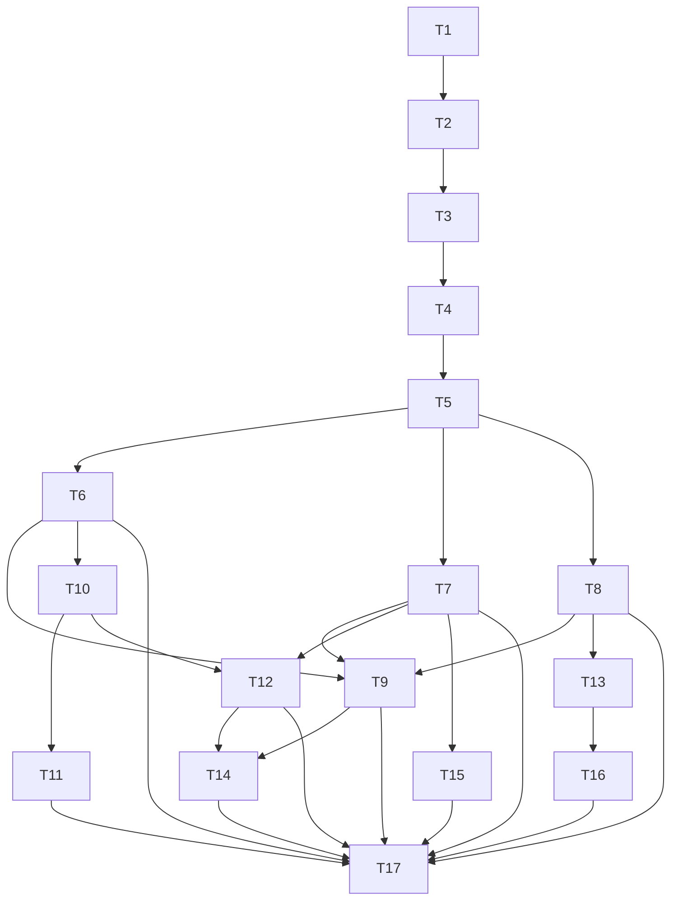

# rs-redact 可复用事务式脱敏架构实施计划

> **执行要求：** 按任务顺序和依赖关系实施；每个行为变更先编写并运行失败测试，再写最小实现，最后执行任务内验证。本文不授权 `git add`、`git commit` 或 `git push`，Git 写操作须另行确认。

**目标：** 将 `rs-redact`、`rs-redact-derive` 及七个直接下游迁移到唯一、可复用、原子发布的 transaction runtime，并用编译失败和回归测试消除旧架构残留。

**架构：** `RedactionPolicy` 生成不可变快照，`Redactor` 创建持有同一快照的 `RedactionSession`。一轮 session transaction 独占预算、聚合缓冲区、单项结果和 summary；聚合 API 写入聚合文本，单项 API 返回 opaque handle，只有 `finish()` 发布后才能解析。domain writer、derive 与六类 format adapter 只借用 transaction runtime，不创建独立预算或结果模型。

**技术栈：** Rust、Cargo、Serde/serde_json、HTTP/URI 解析组件、proc-macro/syn/quote、trybuild、cargo-fuzz、Clippy、Rustdoc。

**设计基准：** [`doc/2026-08-19-rs-redact-transactional-redesign-design.md`](2026-08-19-rs-redact-transactional-redesign-design.md)

**临时工作区：** 不使用。用户明确要求设计与实施方案直接写入 `rs-redact/doc`；实施涉及当前 `dev-starfish` 分支上的多个相邻仓库。

---

## 1. 全局实施约束

1. 不提供旧公开 API 的 deprecated alias、compat module 或临时 facade。
2. 每项删除先用 `rg` 建立引用清单；删除后保留编译错误作为尚未迁移的信号。
3. `rs-redact` 在每个依赖 checkpoint 必须恢复可编译。T5 与 T6 是一个跨仓库原子 checkpoint：T5 结束时不保留旧 derive shim，T6 随即迁移 proc macro 并恢复 all-features 测试。下游仓库只在自己的迁移任务完成后要求恢复可编译。
4. 成熟的字段匹配、掩码、UTF-8 安全截断和格式解析算法可以暂时转为 crate-private，但执行入口必须改接唯一 runtime。
5. 不批量删除测试。每个被替换测试必须在任务记录中映射到新测试名称和所覆盖行为。
6. 所有输出字节，包括 literal、脱敏结果、转义、替代文本和截断标记，都只能由 `TransactionState` 计费一次。
7. 所有执行用户代码的入口都必须经过 panic transaction guard。
8. 任务中的删除、移动和重命名属于计划动作；实际执行前仍需遵守当前工作区规则和用户授权范围。

## 2. 目标文件结构

核心新增或重建文件：

```text
rs-redact/src/
├── runtime/
│   ├── redaction_budget.rs
│   ├── redaction_handle.rs
│   ├── redaction_session.rs
│   ├── redaction_session_output.rs
│   ├── summary_builder.rs
│   ├── transaction_guard.rs
│   └── transaction_state.rs
├── facade/
│   ├── default_redactor.rs
│   ├── redacted_text.rs
│   ├── redaction_output.rs
│   ├── redaction_summary.rs
│   └── redactor.rs
├── domain/
│   ├── redact.rs
│   ├── redact_mut.rs
│   └── redaction_writer.rs
└── formats/
    ├── argv/
    ├── env/
    ├── http/
    ├── json/
    ├── process/
    └── uri/
```

关键新增集成测试：

```text
rs-redact/tests/
├── application_default_tests.rs
├── command_format_transaction_tests.rs
├── derive_contract_tests.rs
├── format_transaction_tests.rs
├── manual_redact_contract_tests.rs
├── public_api_tests.rs
├── shared_budget_tests.rs
├── transaction_session_tests.rs
└── web_format_transaction_tests.rs
```

测试文件可以沿用仓库现有的 `tests/*_tests.rs` module 聚合方式；以上名称用于固定行为边界，避免将关键安全契约散落到格式内部测试。

## 3. 调度表

| ID | 任务 | 依赖 | 可并行条件 | 主要写入范围 | 验收命令 |
|---|---|---|---|---|---|
| T1 | 冻结新公开面并移除旧公开 API | 无 | 独占 `rs-redact/src/lib.rs` | `src/lib.rs`、module exports、`tests/public_api_tests.rs` | `cargo check --all-features` |
| T2 | 重建 policy builder 与应用默认实例 | T1 | 无 | `src/policy/**`、`src/facade/default_redactor.rs` | `cargo test --all-features policy` |
| T3 | 建立 transaction runtime、预算和 summary | T2 | 无 | `src/runtime/**`、output/summary types | `cargo test --all-features --test transaction_session_tests` |
| T4 | 完成 session 聚合、handle、finish 与 panic 原子性 | T3 | 无 | runtime session、facade declarations | transaction/shared-budget tests |
| T5 | 迁移 domain writer、Redactor 与手写 Redact | T4 | 无 | `src/domain/**`、`src/facade/redactor.rs` | domain + derive contract tests |
| T6 | 迁移 rs-redact-derive | T5 | 可与 T7、T8 并行 | `rs-redact-derive/**` | derive 全测试与 trybuild |
| T7 | 迁移 argv、env、process | T5 | 可与 T6、T8 并行 | 三个 format 目录 | command format tests |
| T8 | 迁移 json、uri | T5 | 可与 T6、T7 并行 | 两个 format 目录 | web format tests |
| T9 | 迁移 http | T6、T7、T8 | 无 | `src/formats/http/**` | HTTP + format transaction tests |
| T10 | 迁移 rs-value | T6 | 可与 T13、T15 并行 | `rs-value/**` | rs-value 全测试 |
| T11 | 迁移 rs-metadata | T10 | 可与 T12、T13、T15 并行 | `rs-metadata/**` | rs-metadata 全测试 |
| T12 | 迁移 rs-config | T7、T10 | 可与 T11、T13、T15 并行 | `rs-config/**` | rs-config 全测试 |
| T13 | 迁移 rs-fs | T8 | 可与 T10、T11、T12、T15 并行 | `rs-fs/**` | rs-fs 全测试 |
| T14 | 迁移 rs-http | T9、T12 | 可与 T16 并行 | `rs-http/**` | rs-http 全测试 |
| T15 | 迁移 rs-command | T7 | 可与 T10—T13 并行 | `rs-command/**` | rs-command 全测试 |
| T16 | 迁移 rs-fs-registry | T13 | 可与 T14 并行 | `rs-fs-registry/**` | rs-fs-registry 全测试 |
| T17 | 删除过渡实现，补齐文档、fuzz 与全链路验收 | T6—T16 | 无 | 全部相关仓库 | 全量质量门禁 |



并行实施时，不允许多个任务同时修改 `rs-redact/src/lib.rs`、`src/formats/mod.rs`、`Cargo.toml` 或统一测试入口。T4 先声明完整 session/Redactor format 方法面并建立各 format module；T6—T9 只填充各自实现和专属测试。

---

## 4. 分步实施任务

### T1：冻结新公开面并移除旧公开 API

**文件：**

- 修改：`rs-redact/src/lib.rs`
- 修改：`rs-redact/src/domain/mod.rs`
- 修改：`rs-redact/src/facade/mod.rs`
- 修改：`rs-redact/src/formats/mod.rs`
- 修改：`rs-redact/src/policy/mod.rs`
- 修改：`rs-redact/src/runtime/mod.rs`
- 新建：`rs-redact/src/runtime/redaction_handle.rs`
- 新建：`rs-redact/tests/public_api_tests.rs`
- 删除或转为 crate-private：设计文档第 12 节列出的 compat module 与 facade

**步骤 1：建立旧符号引用清单。**

运行：

```bash
rg -n 'RedactionConfig|RedactionEvent|DiagnosticLogBuilder|DomainValueScope|DomainValueAdmission|DomainTraversalAdmission|DomainTruncated|BoundedRedactedDisplay|Redacted[A-Za-z]+Result|FieldRedaction|RedactionSessionError|ArgvRedactor|EnvRedactor|HttpRedactor|JsonRedactor|UriRedactor' src tests
```

将结果按“生产定义、生产调用、测试调用”分类记录在任务说明中，作为后续迁移清单。

**步骤 2：先写公开面编译测试。**

在 `tests/public_api_tests.rs` 只导入目标公开类型：

```rust
use rs_redact::{
    Redact, RedactedText, RedactionCompletion, RedactionHandle,
    RedactionHandleError, RedactionOutput, RedactionPolicy,
    RedactionSession, RedactionSessionOutput, RedactionSummary,
    RedactionUsage, Redactor,
};
```

测试目标公开类型可构造或可由公开入口获得；旧符号不写正向导入测试，而由步骤 4 的 `rg` 零结果验证。

**步骤 3：建立目标公开类型骨架。**

在移除旧导出前，先定义最终名称、所有权和可见性正确的 `RedactionHandle`、
`RedactionHandleError`、`RedactionUsage` 与新版无生命周期 `RedactionSession` 类型骨架。
本任务只要求这些类型可导入，不提供伪造成功结果的临时实现；行为方法分别由 T2—T5
按失败测试驱动补齐。

**步骤 4：移除旧 re-export 和兼容 module。**

先取消 `src/lib.rs` 与各 `mod.rs` 的公开导出，再将仍被成熟算法依赖的实现改为 `pub(crate)`。删除 `config`、`limits`、`model`、`output` 的重复公开路径，不新建兼容 shim。

**步骤 5：验证旧公开符号已从生产代码消失。**

运行：

```bash
rg -n 'pub (struct|enum|trait|type|mod|use).*?(RedactionConfig|RedactionEvent|DiagnosticLogBuilder|DomainValueScope|DomainValueAdmission|DomainTraversalAdmission|DomainTruncated|BoundedRedactedDisplay|FieldRedaction|RedactionSessionError|ArgvRedactor|EnvRedactor|HttpRedactor|JsonRedactor|UriRedactor)' src
cargo check --all-features
cargo test --all-features --test public_api_tests
```

预期：`rg` 无结果；crate 可编译；公开面测试通过。若生产代码尚依赖旧符号，只允许改成 crate-private 过渡实现，不得恢复公开导出。

**步骤 6：记录测试替换映射。**

对本任务删除的每个旧 API 测试记录对应的新测试文件；尚无替代行为的测试保留为编译失败线索，交给后续任务迁移。

### T2：重建 policy builder 与应用默认实例

**文件：**

- 修改：`rs-redact/src/policy/redaction_policy.rs`
- 修改：`rs-redact/src/policy/redaction_policy_builder.rs`
- 修改：`rs-redact/src/policy/redaction_limits.rs`
- 修改：`rs-redact/src/formats/http/http_redaction_policy_builder.rs`
- 修改：`rs-redact/src/formats/uri/uri_redaction_policy_builder.rs`
- 修改：`rs-redact/src/facade/default_redactor.rs`
- 修改：`rs-redact/src/facade/redactor.rs`
- 新建：`rs-redact/tests/application_default_tests.rs`
- 修改：`rs-redact/tests/policy/redaction_policy_tests.rs`

**步骤 1：先写 builder 原子性测试。**

覆盖以下测试名：

```text
fields_draft_is_applied_only_after_validation
limits_draft_rejects_invalid_values_without_partial_update
http_draft_is_transactional
uri_draft_is_transactional
policy_default_is_deterministic
```

失败用例必须比较构建失败前后的完整 policy 值，证明不存在部分更新。

**步骤 2：实现消费式 namespace builder。**

目标入口：

```rust
impl RedactionPolicyBuilder {
    pub fn fields<F>(self, configure: F) -> Result<Self, PolicyError>;
    pub fn limits<F>(self, configure: F) -> Result<Self, PolicyError>;
    pub fn http<F>(self, configure: F) -> Result<Self, PolicyError>;
    pub fn uri<F>(self, configure: F) -> Result<Self, PolicyError>;
    pub fn build(self) -> Result<RedactionPolicy, PolicyError>;
}
```

每个闭包只操作临时 draft；闭包结束后验证并一次性替换 builder 内对应 namespace。移除 `edit_fields()` 和所有公开 mutable transition view。

**步骤 3：先写默认实例测试。**

在 `tests/application_default_tests.rs` 覆盖：

```text
default_equals_standard_even_after_application_default_changes
replace_application_default_returns_previous_snapshot
existing_redactor_isolated_from_replacement
existing_session_isolated_from_replacement
concurrent_replace_and_read_observe_complete_snapshots
redacted_uses_application_default
redacted_with_uses_explicit_redactor
```

并发测试使用两份可辨识的完整 policy，循环读取时只允许观察到 A 或 B，禁止混合字段。

**步骤 4：实现默认实例 API。**

```rust
impl Redactor {
    pub fn application_default() -> Self;

    #[must_use]
    pub fn replace_application_default(redactor: Self) -> Self;
}
```

全局槽保存完整 `Arc<RedactionPolicy>` 快照；`Default for Redactor` 固定调用 `standard()`。`Redactor::new` 只接受 `RedactionPolicy`。

**步骤 5：验证。**

```bash
cargo test --all-features policy
cargo test --all-features --test application_default_tests
cargo check --all-features
```

### T3：建立 transaction runtime、共享预算和真实 summary

**文件：**

- 新建：`rs-redact/src/runtime/redaction_budget.rs`
- 新建：`rs-redact/src/runtime/summary_builder.rs`
- 新建：`rs-redact/src/runtime/transaction_state.rs`
- 修改：`rs-redact/src/runtime/mod.rs`
- 修改：`rs-redact/src/facade/redaction_summary.rs`
- 修改：`rs-redact/src/facade/redaction_output.rs`
- 修改：`rs-redact/src/facade/redacted_text.rs`
- 修改：`rs-redact/src/output/internal/bounded_log_escape_writer.rs`
- 新建：`rs-redact/tests/transaction_session_tests.rs`
- 新建：`rs-redact/tests/shared_budget_tests.rs`

**步骤 1：先写 usage、completion 与预算失败测试。**

固定测试：

```text
usage_counts_presented_inspected_and_output_bytes_separately
usage_uses_maximum_depth_and_sums_other_counters
unknown_omitted_input_remains_unknown_when_aggregated
completion_only_moves_complete_to_truncated_to_exhausted
reasons_accumulate_without_overwriting_previous_reasons
escaped_bytes_and_markers_consume_output_budget
output_exhaustion_cannot_write_partial_utf8
```

**步骤 2：实现最小信息模型。**

```rust
pub struct RedactionUsage {
    presented_input_bytes: usize,
    inspected_input_bytes: usize,
    output_bytes: usize,
    visited_nodes: usize,
    visited_collection_items: usize,
    max_depth: usize,
    omitted_input_bytes: Option<usize>,
}

pub enum RedactionCompletion { Complete, Truncated, Exhausted }
```

`RedactionSummary` 只包含 completion、reasons、usage；删除 facade 伪造 `Complete` 的构造路径。`RedactedText` 构造保持 crate-private。

**步骤 3：实现唯一预算对象。**

`RedactionBudget` 从 policy limits 创建，提供 input admission、node、collection、depth 与 output reservation。最终写入路径先进行字符安全处理，再按实际保留字节扣减；不得在 adapter 内复制预算。

**步骤 4：实现 TransactionState。**

```rust
struct TransactionState {
    id: TransactionId,
    budget: RedactionBudget,
    output: OutputBuffer,
    items: Vec<ItemRange>,
    summary: SummaryBuilder,
    phase: TransactionPhase,
}
```

输出缓冲区只暴露 crate-private 的 literal、redacted fragment、marker 和 escaped fragment 写入方法，所有方法共用 budget。`OutputExhausted` 后返回跳过信号。

**步骤 5：删除预算绕过。**

```bash
rg -n 'usize::MAX|reset_fragment_budget|append_chain_fragment' src
```

逐个判断结果；用于容量哨兵且与脱敏预算无关的 `usize::MAX` 必须加局部说明，其余全部移除。`reset_fragment_budget` 与 `append_chain_fragment` 必须零结果。

**步骤 6：验证。**

```bash
cargo test --all-features --test transaction_session_tests
cargo test --all-features --test shared_budget_tests
cargo test --all-features text
```

### T4：完成可复用 session、opaque handle、finish 与 panic 原子性

**文件：**

- 新建：`rs-redact/src/runtime/transaction_guard.rs`
- 重写：`rs-redact/src/runtime/redaction_session.rs`
- 重写：`rs-redact/src/runtime/redaction_session_output.rs`
- 删除：`rs-redact/src/runtime/redaction_session_error.rs`
- 修改：`rs-redact/src/facade/redactor.rs`
- 修改：`rs-redact/tests/transaction_session_tests.rs`
- 修改：`rs-redact/tests/shared_budget_tests.rs`

**步骤 1：先写 session 状态机测试。**

```text
chain_and_statement_forms_are_equivalent
finish_publishes_and_resets_the_session
one_session_can_finish_multiple_transactions
aggregate_calls_do_not_create_resolvable_items
handle_calls_do_not_append_aggregate_text
handle_resolves_only_against_its_transaction
missing_item_is_reported_without_panicking
```

**步骤 2：定义 handle 与 output。**

```rust
pub struct RedactionHandle {
    transaction_id: TransactionId,
    item_index: usize,
}

pub enum RedactionHandleError {
    DifferentTransaction,
    MissingItem,
}

impl RedactionSessionOutput {
    pub fn text(&self) -> &RedactedText;
    pub fn summary(&self) -> &RedactionSummary;
    pub fn resolve(&self, handle: RedactionHandle)
        -> Result<&RedactionOutput, RedactionHandleError>;
    pub fn into_resolved(self, handle: RedactionHandle)
        -> Result<RedactionOutput, RedactionHandleError>;
}
```

不要为 handle 实现 `Display`、`AsRef<str>`、`Deref<Target = str>` 或任何字符串转换。

**步骤 3：实现聚合和单项核心入口。**

聚合 `literal`、`field`、`value` 返回 `&mut Self`；单项 `redact_field`、`redact_value` 返回 `RedactionHandle`。`literal` 仅接受 `&'static str`。T4 同时在 session 与 Redactor 中声明 argv、env、http、json、uri、process 的完整方法名，方法体通过 crate-private adapter trait 分派，供 T7—T9 填充。

**步骤 4：实现 finish 原子发布。**

```rust
pub fn finish(&mut self) -> RedactionSessionOutput {
    let fresh = TransactionState::new(Arc::clone(&self.policy));
    let completed = core::mem::replace(&mut self.transaction, fresh);
    completed.publish()
}
```

`finish()` 不返回 error；删除 `RedactionSessionError` 及所有调用路径。

**步骤 5：先写 panic 回归测试。**

```text
panic_rolls_back_aggregate_and_items
panic_propagates_to_the_caller
caught_panic_leaves_session_reusable
handle_from_aborted_transaction_is_invalid
output_exhaustion_skips_later_accessor
output_exhaustion_skips_later_adapter_closure
```

用原子计数器作为 accessor/closure 哨兵，证明耗尽后用户代码未执行。

**步骤 6：实现 transaction guard。**

guard 创建时确保 unwind 期间能将 session transaction 换成新状态；正常返回时提交 guard，panic 时只回滚并继续传播。不得使用 `catch_unwind` 吞掉用户 panic。

**步骤 7：验证编译期不可格式化。**

为 `RedactionHandle` 增加 trybuild compile-fail fixture，表达式 `format!("{handle}")` 必须因缺少 `Display` 失败。

**步骤 8：验证。**

```bash
cargo test --all-features --test transaction_session_tests
cargo test --all-features --test shared_budget_tests
cargo check --all-features
```

### T5：迁移 domain writer、Redactor 与手写 Redact

**文件：**

- 重写：`rs-redact/src/domain/redaction_writer.rs`
- 重写：`rs-redact/src/domain/redact.rs`
- 修改：`rs-redact/src/domain/redact_mut.rs`
- 修改：`rs-redact/src/domain/internal/domain_redaction_context.rs`
- 修改：`rs-redact/src/domain/internal/nested.rs`
- 修改：`rs-redact/src/facade/redactor.rs`
- 新建：`rs-redact/tests/manual_redact_contract_tests.rs`
- 修改：`rs-redact/tests/domain/redact_tests.rs`
- 修改：`rs-redact/tests/domain/internal/redact_mut_tests.rs`

**步骤 1：先写手写实现契约测试。**

覆盖：

```text
writer_literal_accepts_only_program_literals
writer_unredacted_ignores_field_policy
fields_unredacted_ignores_field_policy
fields_sensitive_uses_explicit_level_as_minimum
fields_nested_shares_parent_transaction
fields_map_classifies_each_key
fields_json_classifies_each_json_key
sequence_and_map_unredacted_paths_are_explicit
writer_output_uses_session_budget
```

**步骤 2：收窄 RedactionWriter 写入面。**

```rust
impl RedactionWriter<'_> {
    pub fn literal(&mut self, text: &'static str);
    pub fn unredacted<T: Debug + ?Sized>(&mut self, value: &T);
    pub fn record<F>(&mut self, name: &'static str, configure: F);
    pub fn tuple<F>(&mut self, name: &'static str, configure: F);
    pub fn sequence<F>(&mut self, configure: F);
    pub fn map<F>(&mut self, configure: F);
    pub fn variant<F>(&mut self, enum_name: &'static str, variant_name: &'static str, configure: F);
}
```

writer 只借用 `&mut TransactionState`，不保存 policy 副本、budget、summary 或独立 String。移除动态 `text(&str)`。

**步骤 3：重命名 scope API。**

字段使用 `unredacted`、`sensitive`、`nested`、`map`、`json`；序列使用 `unredacted_item`、`sensitive_item`、`nested_item`；map 使用 `unredacted_entry`、`sensitive_entry`、`nested_entry`。旧 `field()` 不保留 alias。

**步骤 4：实现 sensitivity 合并。**

显式 level 作为最低敏感度，与运行期 policy 分类取更高者；`unredacted` 完全跳过字段名 policy。新增四级敏感度参数化测试，分别覆盖 policy 低于、等于和高于显式 level。

**步骤 5：实现 Redact 默认入口。**

```rust
pub trait Redact {
    fn write_redacted(&self, writer: &mut RedactionWriter<'_>);

    fn redacted(&self) -> RedactionOutput
    where Self: Sized {
        Redactor::application_default().redact(self)
    }

    fn redacted_with(&self, redactor: &Redactor) -> RedactionOutput
    where Self: Sized {
        redactor.redact(self)
    }
}
```

`Redactor::redact` 必须创建 session、取得 handle、finish 并 resolve，不能自行构造 summary 或 `Complete`。

**步骤 6：补齐安全警告 Rustdoc。**

在 `Redact`、`RedactionWriter::unredacted`、fields/list/map 的 unredacted API 上明确写出：未标注字段将原样输出，框架不根据名称或内容推断敏感性，新增业务字段必须审查标注。

**步骤 7：验证。**

```bash
cargo check --lib --all-features
cargo test --all-features --test manual_redact_contract_tests
```

此处不运行依赖旧 proc-macro 展开的集成测试；T6 紧接执行并恢复完整测试集，中间不得
加入兼容 writer 方法。

### T6：迁移 rs-redact-derive 并建立手写 parity

**文件：**

- 修改：`rs-redact-derive/core/src/field_mode.rs`
- 修改：`rs-redact-derive/core/src/field_attributes.rs`
- 修改：`rs-redact-derive/core/src/redact_expansion.rs`
- 修改：`rs-redact-derive/core/src/redact_mut_expansion.rs`
- 修改：`rs-redact-derive/core/src/format_expansion.rs`
- 修改：`rs-redact-derive/tests/redact_expansion_tests.rs`
- 修改：`rs-redact-derive/tests/redact_mut_expansion_tests.rs`
- 修改：`rs-redact-derive/tests/fixtures/pass/basic_named_struct.rs`
- 修改：`rs-redact-derive/tests/fixtures/pass/level_and_skip.rs`
- 修改：`rs-redact-derive/tests/fixtures/pass/map_fields.rs`
- 修改：`rs-redact-derive/tests/fixtures/pass/nested_containers.rs`
- 新建：`rs-redact/tests/derive_contract_tests.rs`

**步骤 1：先固定属性到 writer API 的展开结果。**

```text
无属性                    -> unredacted
#[redact(skip)]           -> 不生成字段访问表达式
#[redact(level = "...")] -> sensitive
#[redact(nested)]         -> nested
#[redact(map)]            -> map
#[redact(json)]           -> json
```

为 named、tuple、enum variant、泛型和 `RedactMut` 分别写 token expansion 断言。

**步骤 2：证明 skip 不访问字段。**

增加带 panic accessor 或访问计数器的 runtime 测试；`#[redact(skip)]` 字段不消耗输入、输出、node 或 collection budget。

**步骤 3：修改 proc-macro 展开。**

未标注字段统一生成 `unredacted`；删除“按字段名隐式分类”与 `require_explicit` 过渡模式。显式 sensitive、nested、map、json 调用 T5 的新 writer scope。

**步骤 4：建立 derive/手写 parity 矩阵。**

在 `rs-redact/tests/derive_contract_tests.rs` 对相同数据分别使用 derive 和手写 `Redact`，逐项比较 text、completion、reasons 和全部 usage 字段。覆盖 record、tuple、enum、generic、nested、map、JSON、Serde rename、Debug 和 Display。

**步骤 5：更新 compile fixtures。**

移除 `require_explicit_missing` 失败语义；新增未标注字段成功展开 fixture，并保留冲突属性、未知 level、错误 map 类型、缺少 JSON feature 的 compile-fail 行为。

**步骤 6：验证 rs-redact-derive。**

```bash
cargo test --all-features
cargo test --test compile_tests
./style-check.sh
```

在 `rs-redact` 再运行：

```bash
cargo test --all-features --test derive_contract_tests
cargo test --doc --all-features
```

### T7：迁移 argv、env、process 到统一 transaction

**文件：**

- 重写：`rs-redact/src/formats/argv/argv_redaction_session.rs`
- 删除公开 facade：`rs-redact/src/formats/argv/argv_redactor.rs`
- 修改：`rs-redact/src/formats/argv/mod.rs`
- 重写：`rs-redact/src/formats/env/env_redaction_session.rs`
- 删除公开 facade：`rs-redact/src/formats/env/env_redactor.rs`
- 修改：`rs-redact/src/formats/env/mod.rs`
- 新建：`rs-redact/src/formats/process/mod.rs`
- 新建：`rs-redact/src/formats/process/process_redaction_session.rs`
- 新建：`rs-redact/tests/command_format_transaction_tests.rs`
- 修改：`rs-redact/tests/argv/**`
- 修改：`rs-redact/tests/argv_tests.rs`
- 修改：`rs-redact/tests/env/**`

**步骤 1：先写三类格式的统一契约。**

每类格式覆盖 aggregate、handle、Redactor convenience、输入截断、输出耗尽、collection limit 和非法输入；集合的一次 handle 调用解析为一个 `RedactionOutput`。

固定 API 行为：

```rust
session.argv(|argv| { argv.arguments(args); });
let argv = session.redact_argv(args);
session.env(|env| { env.variables(vars); });
let env = session.redact_env(vars);
session.process(|process| { process.command(program, args, vars); });
let process = session.redact_process(program, args, vars);
```

具体参数使用现有仓库的借用类型，禁止为了统一签名复制整个 collection。

**步骤 2：让 adapter 只借用 runtime。**

删除 adapter 内部完成状态、独立输出额度和最终 output 构造；argv/env 每访问一个元素计 `visited_collection_items`，process 将 program、argv、env 写入同一 transaction。

**步骤 3：实现便利方法通过 session。**

`Redactor::redact_argv`、`redact_env`、`redact_process` 必须执行“session → handle → finish → into_resolved”，没有第二执行路径。

**步骤 4：写 command-format 共享预算链测试。**

覆盖 `literal → argv → env → process`，精确断言前一操作消耗后后一操作剩余额度；将输出额度设为只能完整容纳前两个结果，证明第三个进入 `Exhausted` 且不访问 collection。

**步骤 5：验证。**

```bash
cargo check --lib --all-features
cargo test --all-features --test command_format_transaction_tests
```

### T8：迁移 JSON 与 URI 到统一 transaction

**文件：**

- 重写：`rs-redact/src/formats/json/json_redaction_session.rs`
- 删除公开 facade：`rs-redact/src/formats/json/json_redactor.rs`
- 修改：`rs-redact/src/formats/json/internal/json_redaction_state.rs`
- 修改：`rs-redact/src/formats/json/mod.rs`
- 重写：`rs-redact/src/formats/uri/uri_redaction_session.rs`
- 删除公开 facade：`rs-redact/src/formats/uri/uri_redactor.rs`
- 修改：`rs-redact/src/formats/uri/internal/bounded_uri_writer.rs`
- 修改：`rs-redact/src/formats/uri/mod.rs`
- 新建：`rs-redact/tests/web_format_transaction_tests.rs`
- 修改：`rs-redact/tests/json/**`
- 修改：`rs-redact/tests/json_tests.rs`
- 修改：`rs-redact/tests/uri/**`
- 修改：`rs-redact/tests/uri_tests.rs`

**步骤 1：先写格式矩阵。**

JSON 与 URI 分别覆盖：合法输入、非法输入、源截断、input/output/node/depth limit、aggregate、handle、Redactor convenience。JSON key 和 URI query key 必须按动态 policy 分类。

**步骤 2：实现 admission-before-parse。**

parser 只能看到 input admission 允许检查的前缀，并分别记录 `presented_input_bytes` 与 `inspected_input_bytes`。源长度未知且被截断时 `omitted_input_bytes` 为 `None`。

**步骤 3：接入 transaction writer。**

JSON state 和 URI writer 不保存 output limit，不构造独立 summary。非法 JSON/URI 写安全替代文本，并添加 `InvalidJson`/`InvalidUri`；替代文本写不完整则 completion 为 `Exhausted`。

**步骤 4：实现便利方法。**

`Redactor::redact_json` 与 `redact_uri` 只通过 session handle 实现。保留成熟 parser/escaping 算法为 crate-private。

**步骤 5：写 web-format 预算测试。**

覆盖 `value → JSON → URI → argv`；断言四类输出字节之和不超过 transaction 上限，URI 耗尽后 argv closure 不执行。

**步骤 6：验证。**

```bash
cargo check --lib --all-features
cargo test --all-features --test web_format_transaction_tests
```

### T9：迁移 HTTP 到统一 transaction

**文件：**

- 重写：`rs-redact/src/formats/http/http_redaction_session.rs`
- 删除公开 facade：`rs-redact/src/formats/http/http_redactor.rs`
- 修改：`rs-redact/src/formats/http/http_redactor/body.rs`
- 修改：`rs-redact/src/formats/http/http_redactor/headers.rs`
- 修改：`rs-redact/src/formats/http/http_redactor/url_rules.rs`
- 修改：`rs-redact/src/formats/http/internal/bounded_body_writer.rs`
- 修改：`rs-redact/src/formats/http/internal/bounded_log_writer.rs`
- 修改：`rs-redact/src/formats/http/mod.rs`
- 新建：`rs-redact/tests/format_transaction_tests.rs`
- 修改：`rs-redact/tests/shared_budget_tests.rs`
- 修改：`rs-redact/tests/http/**`
- 修改：`rs-redact/tests/http_tests.rs`

**步骤 1：先写 HTTP 原子操作测试。**

只允许一项一 handle：

```text
redact_http_url_returns_one_url_item
redact_http_body_returns_one_body_item
redact_http_headers_returns_one_collection_item
aggregate_http_closure_can_append_multiple_operations
http_handle_api_does_not_accept_multi_operation_closure
```

最后一项使用 compile-fail 测试固定“不提供 `redact_http(|...|) -> RedactionHandle`”。

**步骤 2：补齐失败模式。**

覆盖 invalid/unsupported content type、上游 `BodyCapture` 截断、form、JSON、NDJSON、multipart、非 UTF-8 body、nested URL、headers collection limit 和 output exhausted。每种失败同时断言 completion、reason 和 usage。

**步骤 3：移除 HTTP 独立执行状态。**

body、header、URL 规则只接收 transaction writer 和 policy view；删除本地 budget、局部完成状态和最终输出拼装。HTTP body 内调用 JSON/URI 算法时继续借用同一个 transaction，不创建子 session。

**步骤 4：实现 HTTP 公开入口。**

聚合 `session.http(|http| { ... })` 可追加多个原子操作；单项使用 `redact_http_url`、`redact_http_body`、`redact_http_headers`。Redactor 的三个便利方法逐一走 session。

**步骤 5：完成全 format 共享预算链。**

在同一 transaction 中依次执行：

```text
literal → field → value → JSON → HTTP URL → HTTP body → URI → argv → env → process
```

对每个相邻操作至少提供一个“前者消耗导致后者截断或耗尽”的参数化 case，并用哨兵证明耗尽之后不执行 parser/accessor/closure。

**步骤 6：验证。**

```bash
cargo test --all-features http
cargo test --all-features --test format_transaction_tests
cargo test --all-features --test shared_budget_tests
```

### T10：迁移 rs-value

**文件：**

- 检索并修改：`rs-value/src/**`
- 检索并修改：`rs-value/tests/**`
- 修改：`rs-value/Cargo.toml`（仅当 feature 或 path dependency 需要同步）

**步骤 1：建立旧 API 调用清单。**

```bash
rg -n 'rs_redact|Redact|Redaction|redact_' src tests Cargo.toml
```

**步骤 2：先写 value 行为测试。**

覆盖 scalar、sequence、map、nested、JSON feature、unredacted field 和显式 sensitive field；断言 text 与 summary，而不是仅比较 `Display` 文本。

**步骤 3：迁移实现。**

所有 domain 输出改用 T5 writer scopes。未标注字段只有在业务确认不需要脱敏时才使用 `unredacted`；需要动态 key policy 的 map/JSON 必须显式选择对应 scope。

**步骤 4：验证。**

```bash
cargo test --all-features
cargo clippy --all-targets --all-features -- -D warnings
```

### T11：迁移 rs-metadata

**文件：**

- 检索并修改：`rs-metadata/src/**`
- 检索并修改：`rs-metadata/tests/**`
- 修改：`rs-metadata/Cargo.toml`（仅当 feature 或 dependency 需要同步）

**步骤 1：检索旧路径并写 metadata 嵌套/集合回归测试。**

重点覆盖动态 metadata key、嵌套 `rs-value`、空值、超大 collection 和共享 session budget。

**步骤 2：迁移到显式 map/nested 语义。**

metadata key 必须使用动态 policy 分类；已知安全的程序常量只能通过 `literal`，不得把运行期 key 伪装成 literal。

**步骤 3：验证。**

```bash
cargo test --all-features
cargo clippy --all-targets --all-features -- -D warnings
```

### T12：迁移 rs-config

**文件：**

- 检索并修改：`rs-config/src/**`
- 检索并修改：`rs-config/tests/**`
- 修改：`rs-config/Cargo.toml`（仅当 feature 或 dependency 需要同步）

**步骤 1：先写 config 安全回归。**

覆盖配置 key 动态分类、环境变量来源、序列化值、未知字段、输入/输出限制，以及应用默认 Redactor 替换前后的行为。

**步骤 2：迁移旧 config/redactor builder。**

删除对 `RedactionConfig` 与全局 config freeze API 的使用，改由 `RedactionPolicy` builder 构建完整 policy，并通过 `replace_application_default` 安装完整快照。

**步骤 3：验证。**

```bash
cargo test --all-features
cargo clippy --all-targets --all-features -- -D warnings
```

### T13：迁移 rs-fs

**文件：**

- 检索并修改：`rs-fs/src/**`
- 检索并修改：`rs-fs/tests/**`
- 修改：`rs-fs/Cargo.toml`（仅当 URI feature 或 dependency 需要同步）

**步骤 1：先写路径与 URI 回归。**

覆盖本地路径、file URI、非法 URI、query/fragment、非 UTF-8 path 表示和截断预算。

**步骤 2：迁移 URI 调用。**

单项结果使用 `redact_uri` handle 或 Redactor convenience；组合日志使用 session 聚合 `literal` + URI namespace。不得直接构造 `RedactedText`。

**步骤 3：验证。**

```bash
cargo test --all-features
cargo clippy --all-targets --all-features -- -D warnings
```

### T14：迁移 rs-http

**文件：**

- 检索并修改：`rs-http/src/**`
- 检索并修改：`rs-http/tests/**`
- 修改：`rs-http/Cargo.toml`（仅当 HTTP feature 或 dependency 需要同步）

**步骤 1：先写请求/响应 transaction 回归。**

覆盖 URL、headers、body、content type、上游 capture 截断、多个 HTTP 操作共享同一预算，以及 session reuse。

**步骤 2：迁移到原子 handle 与聚合 namespace。**

需要独立 URL/body/header 文本时分别取得 handle，在同一次 `finish()` 后 resolve；只需要组合日志时使用一个 HTTP aggregate closure。不得为每项创建独立 Redactor/session。

**步骤 3：验证。**

```bash
cargo test --all-features
cargo clippy --all-targets --all-features -- -D warnings
```

### T15：迁移 rs-command

**文件：**

- 检索并修改：`rs-command/src/**`
- 检索并修改：`rs-command/tests/**`
- 修改：`rs-command/Cargo.toml`（仅当 argv/env/process feature 或 dependency 需要同步）

**步骤 1：先写 command 回归。**

覆盖 program、argv、env、空参数、重复 env key、非 Unicode OS 值、安全替代文本、collection/output limit 和 process aggregate/handle。

**步骤 2：迁移到 process adapter。**

组合命令脱敏使用一次 process 操作；确需分别消费 argv/env 时在同一 session 中取得两个 handle 后统一 finish。不得重建旧 `ArgvRedactor`/`EnvRedactor` facade。

**步骤 3：验证。**

```bash
cargo test --all-features
cargo clippy --all-targets --all-features -- -D warnings
```

### T16：迁移 rs-fs-registry

**文件：**

- 检索并修改：`rs-fs-registry/src/**`
- 检索并修改：`rs-fs-registry/tests/**`
- 修改：`rs-fs-registry/Cargo.toml`（仅当 dependency 需要同步）

**步骤 1：先写 registry 集成回归。**

覆盖 registry key、后端 URI、嵌套 rs-fs 类型、多个结果共享 budget 和错误消息组合。

**步骤 2：迁移实现。**

动态 registry key 使用 field/map policy；后端地址使用 URI adapter；最终日志只在 finish 后读取聚合文本或 resolve handle。

**步骤 3：验证。**

```bash
cargo test --all-features
cargo clippy --all-targets --all-features -- -D warnings
```

### T17：删除过渡实现，补齐文档、fuzz 与全链路验收

**文件：**

- 清理：`rs-redact/src/**` 中仅为旧架构保留的 crate-private 过渡实现
- 修改：`rs-redact/fuzz/fuzz_targets/command_inputs.rs`
- 修改：`rs-redact/fuzz/fuzz_targets/direct_inputs.rs`
- 新建：`rs-redact/fuzz/fuzz_targets/transaction_sequences.rs`
- 修改：`rs-redact/README.md`
- 修改：`rs-redact/README.zh_CN.md`
- 修改：`rs-redact/doc/user_guide.md`
- 修改：`rs-redact/doc/user_guide.zh_CN.md`
- 修改：`rs-redact-derive/README.md`
- 修改：`rs-redact-derive/README.zh_CN.md`
- 修改：`rs-redact-derive/doc/user_guide.md`
- 修改：`rs-redact-derive/doc/user_guide.zh_CN.md`

**步骤 1：执行旧架构零残留扫描。**

```bash
rg -n 'RedactionConfig|RedactionEvent|DiagnosticLogBuilder|DomainValueScope|DomainValueAdmission|DomainTraversalAdmission|DomainTruncated|BoundedRedactedDisplay|Redacted[A-Za-z]+Result|FieldRedaction|RedactionSessionError|ArgvRedactor|EnvRedactor|HttpRedactor|JsonRedactor|UriRedactor|reset_fragment_budget|append_chain_fragment|edit_fields' .
```

生产代码必须零结果。历史设计文档中的文本命中不删除；测试 fixture 若刻意验证旧符号不可用，必须有清晰注释。

**步骤 2：执行第二预算与伪造 summary 扫描。**

```bash
rg -n 'usize::MAX|RedactionCompletion::Complete|RedactionSummary::new|RedactedText::new|Redactor::new|RedactionBudget' src
```

逐项证明：预算只在 transaction 创建；Complete 只由 summary builder 初始状态产生；RedactedText 只由发布路径构造；adapter 不创建 Redactor。

**步骤 3：扩展 fuzz。**

`transaction_sequences` 从字节流生成多轮 aggregate/handle/format/finish 序列，断言：总输出不超预算、handle 不跨 transaction、finish 后 session 可复用、任何输出都是有效 UTF-8。现有 command/direct fuzz target 改用 process 与 session API。

**步骤 4：更新双语文档。**

README 与 user guide 必须包含：应用默认值命名、policy builder、聚合/handle 两种用法、finish 原子发布、session reuse、panic 语义、全部六类 format、unredacted 安全警告和破坏性迁移表。中英文示例使用同一 API，并由 doctest 覆盖核心示例。

**步骤 5：执行 rs-redact 质量门禁。**

```bash
cargo fmt --all -- --check
cargo check --all-targets --all-features
cargo test --all-features
cargo clippy --all-targets --all-features -- -D warnings
cargo doc --all-features --no-deps
./style-check.sh
```

**步骤 6：执行 rs-redact-derive 质量门禁。**

```bash
cargo fmt --all -- --check
cargo check --all-targets --all-features
cargo test --all-features
cargo clippy --all-targets --all-features -- -D warnings
cargo doc --all-features --no-deps
./style-check.sh
```

**步骤 7：执行七个下游质量门禁。**

在 `rs-value`、`rs-metadata`、`rs-config`、`rs-fs`、`rs-http`、`rs-command`、`rs-fs-registry` 逐一运行：

```bash
cargo fmt --all -- --check
cargo check --all-targets --all-features
cargo test --all-features
cargo clippy --all-targets --all-features -- -D warnings
```

**步骤 8：执行 fuzz 冒烟。**

```bash
cargo fuzz run command_inputs -- -max_total_time=60
cargo fuzz run direct_inputs -- -max_total_time=60
cargo fuzz run transaction_sequences -- -max_total_time=120
```

**步骤 9：最终差异审查。**

```bash
git diff --check
git diff --stat
git status --short
```

确认只包含计划范围内文件；列出用户原有未提交改动并与本轮改动区分。未经用户明确授权，不执行 add、commit、merge、push 或清理工作区。

---

## 5. 强制回归矩阵

| 契约 | 最低覆盖 |
|---|---|
| Session 复用 | 链式与逐语句等价；连续三次 finish；每次自动重置 |
| 原子发布 | finish 前 handle 无文本能力；finish 后可 resolve；跨 transaction 拒绝 |
| Panic | 整轮回滚；panic 继续传播；catch 后 session 可复用；旧 handle 失效 |
| 聚合/单项隔离 | aggregate 不产生 item；handle 不写 aggregate；summary 同时覆盖二者 |
| 输出预算 | literal、field、value、转义、marker、六类 format 共享一个上限 |
| 输入/结构预算 | admission 在 parse/access 前；node、collection、depth 由 transaction 统一计数 |
| 耗尽短路 | 后续 accessor、parser、adapter closure 均不执行 |
| Summary | completion 单调；reason 累积；usage 计数/最大深度/未知 omitted 聚合正确 |
| Domain writer | literal 静态；unredacted 明示；sensitive 最低级别；nested 共用 runtime |
| Derive | 未标注原样；skip 不访问；level/nested/map/json 显式；与手写实现 parity |
| Formats | argv/env/http/json/uri/process 均有 aggregate、handle、Redactor convenience |
| 默认实例 | Default 确定；应用默认完整快照；replace 返回旧值；并发无混合状态 |
| 公开面 | 旧符号零导出；无 compat shim；RedactedText 构造不公开 |

## 6. 完成判定

只有同时满足以下条件，才可宣布重构完成：

1. T1—T17 的任务内测试和最终质量门禁全部通过。
2. 旧公开 API、独立 format redactor、第二预算、keyed result 和 session error 模型均无生产代码残留。
3. 六类 format、domain writer、derive 与 Redactor convenience 经过代码检查，确认只走同一个 `TransactionState`。
4. 全 format 共享预算链、panic 回滚、handle 跨 transaction、derive parity 和 output exhausted 短路测试全部存在且通过。
5. 七个直接下游全部完成破坏性迁移，不依赖兼容层。
6. 设计文档、实施计划、双语 README、双语 user guide 与最终公开 API 一致。
7. 最终 `git diff --check` 无错误，工作区中用户原有改动未被覆盖或清理。

