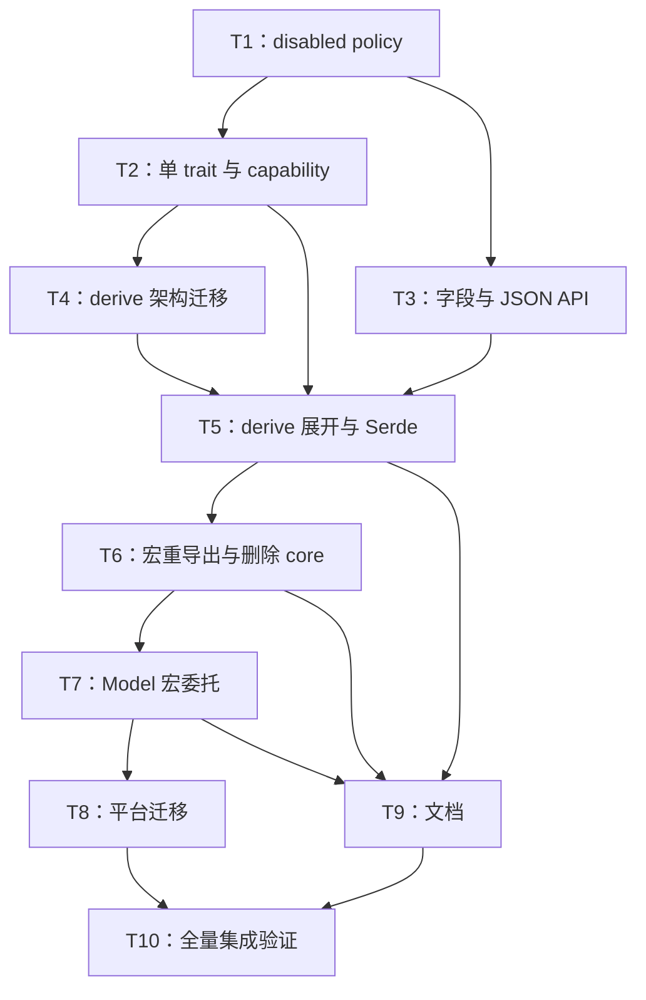

# rs-redact 单 trait 与 derive 重构实施计划

> **历史文档：** 本文是已执行的跨仓库实施记录，不是当前待执行计划。当前架构、默认 feature
> 和公开契约以 [`design.zh_CN.md`](design.zh_CN.md) 与
> [`user_guide.zh_CN.md`](user_guide.zh_CN.md) 为准。

> **面向智能体执行者：** 必须使用 superpowers:subagent-driven-development（推荐）或 superpowers:executing-plans，逐项实施本计划。各步骤使用复选框（`- [ ]`）语法跟踪进度。

**目标：** 将 `rs-redact` 收敛为借用输出的单 `Redact` trait，重写结构化 derive/Serde/JSON 能力，并把 `rs-model-derive` 与 `rs-platform` 平滑迁移到公开 derive。

**架构：** runtime 统一持有 policy、预算、summary 与密封字段 capability；derive 只生成结构访问和隐藏的结构化 Serde capability。`qubit-redact` 默认重导出 derive 宏，`#[Model(redact)]` 通过组合公开 derive 取代对 derive-core 的内部调用。

**技术栈：** Rust 2024、MSRV 1.94、`syn` 2、`quote`、`proc-macro-crate`、Serde、`serde_json`、`trybuild`、Cargo workspace。

**Temporary Workspace:** `/tmp/superpowers-9zKVEw`

**临时工作区清理：** 执行期间必须保留该工作区，直至任务成功完成。成功后，仅在完成相同的路径组件验证后才能删除；不得使用字符串前缀判断包含关系。必须确认：解析后的工作区不是解析后的临时根目录；其解析后的父目录与临时根目录完全相同；其目录名以 `superpowers-` 开头；`.superpowers-session` 是空的、非符号链接的普通文件。如果执行时存在当前仓库，还必须证明工作区与仓库完全双向不重叠：任一路径都不等于另一路径，也不包含另一路径。否则，应记录未检测到当前仓库，并继续完成其余验证。

## 全局约束

- 设计基线：`/tmp/superpowers-9zKVEw/2026-08-23-rs-redact-redesign-design.md`。
- 只保留 `Redact::write_redacted(&self, &mut RedactionWriter<'_>)`；删除全部 mutable/object-transform API。
- `RedactionPolicy` 提供 `disabled()`、`is_disabled()`、`set_disabled(bool)`；disabled 仍执行预算和日志转义。
- 无标记字段原样输出；递归必须显式 `#[redact(nested)]`。
- 删除 `plain`、`no_mut`、`require_explicit`；保留 `debug`、`display`、`serde`。
- `#[redact(skip)]` 在 disabled 模式恢复；普通 `#[serde(skip)]` 永不恢复。
- `High`、`Secret` 不调用叶子的格式化或敏感字段 Serde adapter。
- `#[redact(serde)]` 直接实现结构化 `Serialize`；不生成 `Deserialize`。
- `qubit-redact` 默认 feature 为 `serde + derive`，并重导出 derive 宏。
- 不覆盖 `/home/starfish/working/qubit/rust-platform/` 下现有未提交修改；实施前逐仓库重新检查 `git status --short`。
- 未经用户后续明确授权，不执行 `git add`、`git commit` 或 `git push`；每个任务以验证检查点代替提交步骤。

---

## 调度图（必填）

| 任务 | 前置任务 | 最小解锁产物 | 写入集合 | 本地验证 | 集成验证归属 | 审查时机 |
| --- | --- | --- | --- | --- | --- | --- |
| T1 | 无 | disabled policy、summary 与 inspection 状态可编译 | `rs-redact/src/policy/**`、`facade/redaction_summary.rs`、inspection 状态文件及对应测试 | `cargo test --test policy_tests --test inspection_tests` | T10 | 立即审查 |
| T2 | T1 | 单 `Redact` trait、字段 capability、writer enabled/disabled 行为可编译 | `rs-redact/src/domain/**`、`src/lib.rs`、domain/writer 测试 | domain focused tests | T10 | 立即审查 |
| T3 | T1 | 通用字段格式化与借用 JSON Value API 可用 | `rs-redact/src/facade/**`、`src/formats/json/**`、JSON/field tests | JSON 与 field focused tests | T10 | 立即审查 |
| T4 | T2 | derive-core 内容迁入 `src/`，新属性/model/parser 可编译 | `rs-redact-derive/src/**`、parser/model 单元测试 | `cargo test --lib` | T10 | 立即审查 |
| T5 | T2、T3、T4 | Redact/Debug/Display/Serde 展开及 UI/runtime 回归通过 | `rs-redact-derive/src/expand/**`、`src/serde/**`、`tests/**` | derive trybuild/runtime tests | T10 | 立即审查 |
| T6 | T5 | derive-core crate 删除，runtime 默认重导出宏 | 两 crate 的 `Cargo.toml`、`Cargo.lock`、`rs-redact/src/lib.rs`、feature tests | 两 crate feature checks | T10 | 立即审查 |
| T7 | T6 | `#[Model(redact)]` 委托 `qubit_redact::Redact` | `rs-model-derive/Cargo.toml`、`src/model_attribute.rs`、tests/fixtures | `cargo test`（rs-model-derive） | T10 | 立即审查 |
| T8 | T7 | 平台旧 mutable 使用迁移且模型编译 | `rs-platform/modules/**` 中 Redact 迁移文件与测试 | 受影响 package tests | T10 | 批量审查 |
| T9 | T5、T6、T7 | 中英文 Rustdoc、README、用户手册同步 | 两 redact crate 与 model-derive 的文档文件 | doctest/readme fixture | T10 | 批量审查 |
| T10 | T8、T9 | 五仓库完整验证记录 | 仅允许修复验证发现的直接相关问题 | 全量 CI 等价命令 | T10 | 立即审查 |

资源组：T1—T6 共享 `rust-common` Cargo target，重型命令串行；T7—T10 共享 `rust-platform` target，workspace 全量命令只在 T10 运行。

## 任务拓扑依赖图（必填）



### T1：实现全局 disabled policy 与可观察状态

**文件：**
- 修改：`rs-redact/src/policy/redaction_policy.rs`
- 修改：`rs-redact/src/policy/redaction_policy_builder.rs`
- 修改：`rs-redact/src/facade/redaction_summary.rs`
- 修改：`rs-redact/src/facade/redaction_inspection.rs`
- 修改：`rs-redact/src/facade/redaction_inspection_error.rs`
- 修改：`rs-redact/src/runtime/summary_builder.rs`
- 测试：`rs-redact/tests/policy_tests.rs`
- 测试：`rs-redact/tests/inspection_tests.rs`
- 测试：`rs-redact/tests/application_default_tests.rs`

**接口：**
- 输入依赖：无。
- 输出接口：`RedactionPolicy::{disabled,is_disabled,set_disabled}`、`RedactionSummary::is_redaction_disabled()`、`RedactionInspection::is_redaction_disabled()`。

**调度：** 前置无；写入集合仅 policy/summary/inspection；本地运行 focused tests；T10 负责全量；立即审查。

- [x] **步骤 1：先写 policy 状态回归测试**

```rust
#[test]
fn disabled_policy_can_be_toggled_without_losing_configuration() {
    let mut policy = RedactionPolicy::standard();
    assert!(!policy.is_disabled());
    assert!(policy.set_disabled(true).is_disabled());
    assert!(RedactionPolicy::disabled().is_disabled());
    assert!(policy.to_builder().build().unwrap().is_disabled());
    assert!(!policy.set_disabled(false).is_disabled());
}
```

- [x] **步骤 2：运行测试并确认因 API 缺失失败**

运行：`cd rs-redact && cargo test --test policy_tests disabled_policy_can_be_toggled_without_losing_configuration`

预期：编译失败，提示 `disabled`、`is_disabled` 或 `set_disabled` 不存在。

- [x] **步骤 3：实现 policy 字段和复制语义**

```rust
pub struct RedactionPolicy {
    disabled: bool,
    // existing fields
}

pub fn disabled() -> Self {
    let mut policy = Self::standard();
    policy.disabled = true;
    policy
}

pub const fn is_disabled(&self) -> bool { self.disabled }

pub fn set_disabled(&mut self, disabled: bool) -> &mut Self {
    self.disabled = disabled;
    self
}
```

同时让 `RedactionPolicyBuilder` 的 `from_policy()`/`build()` 携带 `disabled`。

- [x] **步骤 4：为 summary 与 inspection 写 disabled 测试并实现状态传播**

```rust
let output = Redactor::new(RedactionPolicy::disabled()).redact_field("token", "raw");
assert!(output.summary().is_redaction_disabled());
let inspection = Redactor::new(RedactionPolicy::disabled())
    .inspect_field("token", "raw")
    .expect("disabled inspection is conclusive");
assert!(inspection.is_redaction_disabled());
```

保持 `RedactionInspectionResult = Result<RedactionInspection, RedactionInspectionError>` 不变；在 `RedactionInspection` 中增加布尔状态，避免把原有成功/失败通道改成不兼容的枚举。

- [x] **步骤 5：运行 focused tests**

运行：`cd rs-redact && cargo test --test policy_tests --test inspection_tests --test application_default_tests`

预期：全部通过；现有 application-default 快照测试不回归。

- [x] **步骤 6：记录检查点，不执行 Git 写操作**

记录 T1 的测试命令和结果；等待立即审查。

### T2：删除 mutable API，建立单 trait、容器递归和字段 capability

**文件：**
- 修改：`rs-redact/src/domain/redact.rs`
- 修改：`rs-redact/src/domain/redaction_writer.rs`
- 修改：`rs-redact/src/domain/internal/nested.rs`
- 新建：`rs-redact/src/domain/redact_level_value.rs`
- 新建：`rs-redact/src/domain/redact_map_value.rs`
- 新建：`rs-redact/src/domain/redact_json_value.rs`
- 修改：`rs-redact/src/domain/mod.rs`
- 修改：`rs-redact/src/lib.rs`
- 删除：`rs-redact/src/domain/redact_mut.rs`
- 删除：`rs-redact/src/domain/redact_value_mut.rs`
- 删除：`rs-redact/src/domain/redact_map_value_mut.rs`
- 测试：`rs-redact/tests/domain/redact_tests.rs`
- 新建测试：`rs-redact/tests/domain/redact_level_value_tests.rs`
- 新建测试：`rs-redact/tests/domain/redact_container_tests.rs`
- 删除旧测试：`rs-redact/tests/domain/internal/redact_mut_tests.rs`、`redact_value_mut_tests.rs`、`redact_map_value_mut_tests.rs`

**接口：**
- 输入依赖：T1 的 `RedactionPolicy::is_disabled()`。
- 输出接口：唯一 `Redact::write_redacted()`；`Option/Vec/array/tuple` 的递归 `Redact`；`#[doc(hidden)] pub mod internal` 内的 sealed capability `RedactLevelValue`、`RedactMapValue`、`RedactJsonValue`，以及 `serde` feature 下的 `RedactSerialize`。

**调度：** 前置 T1；写入 domain/lib；本地 domain tests；T10 全量；立即审查。

- [x] **步骤 1：写编译与行为测试，证明旧 API 消失且容器可递归**

```rust
struct Child { token: String }
impl Redact for Child {
    fn write_redacted(&self, writer: &mut RedactionWriter<'_>) {
        writer.record("Child", |fields| {
            fields.sensitive(Sensitivity::Secret, "token", || &self.token);
        });
    }
}

let children = Some(vec![Child { token: "raw".into() }]);
let output = Redactor::standard().redact(&children);
assert!(!output.text().as_str().contains("raw"));
```

为 tuple 1—12、数组和 `Option<Vec<T>>` 添加代表性测试。derive compile fixture 延后到 T5，避免 T2 反向依赖尚未重导出的宏。

- [x] **步骤 2：运行测试并确认旧实现无法满足新 trait/capability**

运行：`cd rs-redact && cargo test --test domain_tests`

预期：新测试编译失败或行为失败。

- [x] **步骤 3：把 `Redact` 收敛为唯一方法并删除 mutable 模块/导出**

```rust
pub trait Redact {
    fn write_redacted(&self, writer: &mut RedactionWriter<'_>);
}
```

从 `domain/mod.rs`、`lib.rs` 和 doctest 删除所有 mutable re-export 与方法示例。

- [x] **步骤 4：实现递归容器与密封 capability**

```rust
#[doc(hidden)]
pub trait RedactLevelValue: private::Sealed {
    fn write_level(&self, level: Sensitivity, writer: &mut RedactionWriter<'_>);
}

impl<T: Redact> Redact for Option<T> { /* Some/None structured output */ }
impl<T: Redact> Redact for Vec<T> { /* writer.sequence */ }
impl<T: Redact, const N: usize> Redact for [T; N] { /* writer.sequence */ }
```

用宏生成 tuple 1—12 的 `Redact` 与 `RedactLevelValue` 实现；只为设计中列出的标量实现 sealed capability。

在 `serde` feature 下锁定父子结构化序列化的内部接口（名字公开但文档隐藏，不属于稳定用户 API）：

```rust
#[doc(hidden)]
pub trait RedactSerialize {
    fn serialize_redacted<S>(
        &self,
        serializer: S,
        policy: &RedactionPolicy,
    ) -> Result<S::Ok, S::Error>
    where
        S: serde::Serializer;
}
```

父级 nested 调用必须把同一份 `policy` 传给子级；实现不得重新读取 application default。预算上下文由 derive 生成的结构化 carrier 内部持有，不暴露第二套公开 transaction API。

- [x] **步骤 5：让 writer 集中处理 enabled/disabled 字段模式**

```rust
pub fn skipped<T, F>(&mut self, name: &str, access: F) -> &mut Self
where T: Debug, F: FnOnce() -> T {
    if self.writer.session.policy().is_disabled() {
        self.unmarked(name, access)
    } else {
        self
    }
}
```

同样为 `sensitive`、`nested`、`map`、`json` 在入口实现 disabled 原样分支；启用模式保持惰性与预算顺序。

- [x] **步骤 6：运行 domain focused tests**

运行：`cd rs-redact && cargo test --test domain_tests --test field_redaction_tests`

预期：新旧非 mutable 测试通过，源码中 `rg 'RedactMut|redact_in_place|to_redacted|into_redacted' src tests` 无生产命中。

- [x] **步骤 7：记录检查点，不执行 Git 写操作**

### T3：通用字段格式化与一次解析的借用 JSON API

**文件：**
- 修改：`rs-redact/src/facade/redactor.rs`
- 修改：`rs-redact/src/facade/redaction_batch.rs`
- 修改：`rs-redact/src/facade/redacted_text_composer.rs`
- 修改：`rs-redact/src/runtime/redaction_session.rs`
- 修改：`rs-redact/src/formats/json/internal/json_structure_seed.rs`
- 修改：`rs-redact/src/formats/json/internal/json_structure_visitor.rs`
- 修改：`rs-redact/src/formats/json/json_redaction_writer.rs`
- 修改：`rs-redact/src/formats/json/mod.rs`
- 测试：`rs-redact/tests/field_redaction_tests.rs`
- 测试：`rs-redact/tests/streaming_display_allocation_tests.rs`
- 测试：`rs-redact/tests/json_tests.rs`
- 测试：`rs-redact/tests/json_floor_tests.rs`

**接口：**
- 输入依赖：T1 的 disabled policy。
- 输出接口：Display 泛型字段 API；`Redactor::{redact_json_value,inspect_json_value}` 及 batch/writer 对应 API；单次 admitted parse。

**调度：** 前置 T1；与 T2 写集不同可同批；本地 field/json tests；T10 全量；立即审查。

- [x] **步骤 1：写 lazy formatting 回归**

```rust
struct PanicDisplay;
impl Display for PanicDisplay {
    fn fmt(&self, _: &mut Formatter<'_>) -> fmt::Result { panic!("must stay lazy") }
}

let output = redactor.redact_field("secret", &PanicDisplay);
assert!(!output.text().as_str().is_empty());
```

另测 `format_args!("{debug_only:?}")`、Low/Medium 会格式化、超限 fail-closed。

- [x] **步骤 2：把三个字段入口改为 `T: Display + ?Sized` 并先分类后格式化**

```rust
pub fn redact_field<T>(&self, field: &str, value: &T) -> RedactionTextOutput
where T: Display + ?Sized;
```

batch、composer、session 使用同一泛型，不增加 debug/display 方法族。

- [x] **步骤 3：写借用 Value 与“文本只解析一次”测试**

```rust
let value = serde_json::json!({"token": "raw", "name": "ada"});
let output = redactor.redact_json_value(&value);
assert!(!output.text().as_str().contains("raw"));
assert_eq!(value["token"], "raw");
```

为 deep/node/input limit、invalid JSON opaque fallback、inspection 添加测试；测试 hook 断言文本 seed 只进入一次 parse。

- [x] **步骤 4：让 structure seed/visitor 构建 admitted `Value`，渲染器借用遍历**

```rust
pub(crate) fn admit_json_text(
    session: &mut RedactionSession,
    text: &str,
) -> Result<serde_json::Value, JsonAdmissionError>;
```

删除“先 admission parse、再 redaction parse”的双解析；Value API 直接借用，不 clone、不 `to_string()`。

- [x] **步骤 5：接通 facade、batch、writer 与 fields API**

实现设计中的五个 Value 入口，并确保所有入口共享 transaction budget 和 summary。

- [x] **步骤 6：运行 focused tests并记录检查点**

运行：`cd rs-redact && cargo test --features json --test field_redaction_tests --test streaming_display_allocation_tests --test json_tests --test json_floor_tests`

预期：全部通过；invalid/limit 测试无原文泄漏。

### T4：把 derive-core 代码迁入主 proc-macro crate并重建解析模型

**文件：**
- 修改：`rs-redact-derive/src/lib.rs`
- 新建：`rs-redact-derive/src/attributes/{mod.rs,container.rs,field.rs,serde.rs}`
- 新建：`rs-redact-derive/src/model/{mod.rs,container.rs,field.rs,variant.rs}`
- 新建：`rs-redact-derive/src/expand/mod.rs`
- 新建：`rs-redact-derive/src/serde/mod.rs`
- 新建：`rs-redact-derive/src/runtime_path.rs`
- 迁移测试：原 core integration parser/model tests 改为上述模块内 `#[cfg(test)]`。

**接口：**
- 输入依赖：T2 的 trait/capability 名称。
- 输出接口：`expand(&DeriveInput) -> syn::Result<TokenStream>`；字段模式仅 `Unmarked/Level/Nested/Map/Json/Skip`。

**调度：** 前置 T2；写入 derive/src；本地 `cargo test --lib`；T10 全量；立即审查。

- [x] **步骤 1：在新模块内先写属性 model 单元测试**

```rust
assert!(matches!(parse_field("value: String"), FieldMode::Unmarked));
assert!(parse_field("#[redact(plain)] value: String").is_err());
assert!(parse_container("#[redact(no_mut)] struct X;").is_err());
```

覆盖删除的 `plain/no_mut/require_explicit`、重复模式、未知 level 和 Serde 属性解析。

- [x] **步骤 2：迁移可靠 parser/model/runtime-path 代码，删除历史双轨字段**

```rust
enum FieldMode {
    Unmarked,
    Level(Sensitivity),
    Nested,
    Map,
    Json,
    Skip,
}
```

保留 enum tagging、rename、generics、crate rename 解析；不迁移 `RedactOptions`、mutable expansion 与 inherent convenience generation。

- [x] **步骤 3：让 `src/lib.rs` 直接调用内部 expansion**

```rust
#[proc_macro_derive(Redact, attributes(redact, serde))]
pub fn derive_redact(input: TokenStream) -> TokenStream {
    syn::parse(input)
        .and_then(|input| expand::expand(&input))
        .unwrap_or_else(syn::Error::into_compile_error)
        .into()
}
```

- [x] **步骤 4：运行主 crate 单元测试**

运行：`cd rs-redact-derive && cargo test --lib`

预期：parser/model/runtime-path 单元测试通过；此任务暂不删除 `core/`，由 T6 在下游切换前统一删除。

- [x] **步骤 5：记录检查点，不执行 Git 写操作**

### T5：实现新 Redact、格式化与结构化 Serde expansion

**文件：**
- 新建：`rs-redact-derive/src/expand/{redact.rs,format.rs,assertions.rs}`
- 新建：`rs-redact-derive/src/serde/{entry.rs,field.rs,struct.rs,enum.rs,naming.rs}`
- 新建：`rs-redact-derive/tests/fixtures/pass/{recursive_level_containers.rs,nested_container_serde.rs,disabled_fields.rs,serde_wire_shape.rs,json_string_variants.rs}`
- 新建：`rs-redact-derive/tests/fixtures/fail/{level_struct.rs,level_struct.stderr,sensitive_serde_adapter.rs,sensitive_serde_adapter.stderr,map_wrong_key.rs,map_wrong_key.stderr,nested_without_redact_serialize.rs,nested_without_redact_serialize.stderr}`
- 删除：`rs-redact-derive/tests/fixtures/pass/{redact_mut.rs,require_explicit.rs}`
- 删除：`rs-redact-derive/tests/fixtures/fail/{missing_no_mut.rs,missing_no_mut.stderr,require_explicit_missing.rs,require_explicit_missing.stderr}`
- 修改：保留下来的 `rs-redact-derive/tests/fixtures/pass/basic_named_struct.rs`、`level_and_skip.rs`、`map_fields.rs`、`nested_containers.rs`、`safe_formatting.rs`、`serde_coverage_shapes.rs`、`tuple_and_unit_structs.rs`
- 修改：`rs-redact-derive/tests/compile_tests.rs`
- 修改：`rs-redact-derive/tests/unified_redact_tests.rs`
- 修改：`rs-redact-derive/tests/serde_*_tests.rs`

**接口：**
- 输入依赖：T2 runtime capability/writer；T3 JSON API；T4 model。
- 输出接口：`impl Redact`、可选 `Debug/Display/Serialize`、T2 已定义的 `internal::RedactSerialize` 实现。

**调度：** 前置 T2/T3/T4；写 derive expansion/tests；本地 trybuild/runtime；T10 全量；立即审查。

- [x] **步骤 1：新增通过/失败 fixture**

通过：递归 LevelValue 容器、nested `Option<Vec<T>>`、map、JSON string variants、disabled skip 恢复、Serde numeric leaf 变 string。

失败 fixture 代码示例：

```rust
#[derive(Redact)]
struct Bad { #[redact(level = "secret")] child: Child }
```

并覆盖敏感字段 `serialize_with`、错误 map key/value、nested Serde 子类型缺 capability。

- [x] **步骤 2：运行 trybuild，确认新 fixture 先失败**

运行：`cd rs-redact-derive && cargo test --test compile_tests`

预期：新 pass fixture 编译失败、新 fail stderr 尚未匹配。

- [x] **步骤 3：生成 writer 调用和字段 capability assertion**

```rust
match mode {
    Unmarked => quote!(__fields.unmarked(name, || value)),
    Level(level) => quote!(__fields.sensitive(#level, name, || value)),
    Nested => quote!(__fields.nested(name, value)),
    Map => quote!(__fields.map(name, value)),
    Json => quote!(__fields.json(name, value)),
    Skip => quote!(__fields.skipped(name, || value)),
}
```

enum 的 skip 字段仍绑定，因为 disabled 模式需要恢复值。

- [x] **步骤 4：生成 Debug/Display 和结构化 Serialize**

直接 `Serialize` 获取一次 application-default policy；结构化 field carrier 保留 Serde rename/tag/shape。masked 非空叶子序列化成 string；`None` 为 null。生成公开 `#[doc(hidden)] RedactSerialize` 供 nested 子类型实现，父级传入同一 policy。

- [x] **步骤 5：实现 Serde 组合规则**

```rust
let should_emit = if policy.is_disabled() {
    !serde_skip && !skip_if(raw)
} else {
    !serde_skip && !matches!(mode, FieldMode::Skip) && !skip_if(raw)
};
```

`Skip` 启用时不调用 predicate；敏感模式拒绝 `with/serialize_with`；无标记字段保留 adapter。

- [x] **步骤 6：运行 derive focused tests**

运行：`cd rs-redact-derive && cargo test --all-features --test compile_tests --test unified_redact_tests --test serde_expansion_tests --test serde_enum_representation_tests`

预期：全部通过；更新后的 stderr 具有字段名和修复建议。

- [x] **步骤 7：记录检查点，不执行 Git 写操作**

### T6：删除 derive-core并由 runtime 默认重导出宏

**文件：**
- 修改：`rs-redact/Cargo.toml`
- 修改：`rs-redact/src/lib.rs`
- 修改：`rs-redact/Cargo.lock`
- 修改：`rs-redact-derive/Cargo.toml`
- 修改：`rs-redact-derive/Cargo.lock`
- 删除：`rs-redact-derive/core/**`
- 更新：`rs-redact-derive/tests/fixtures/crates/*/Cargo.lock`
- 测试：`rs-redact/tests/feature_gate_compile_tests.rs`
- 测试：`rs-redact/tests/crate_name_tests.rs`

**接口：**
- 输入依赖：T5 可发布的 `qubit-redact-derive::Redact`。
- 输出接口：默认 feature `derive`；`qubit_redact::Redact` 同时解析 trait 和宏命名空间。

**调度：** 前置 T5；写 Cargo/lib/core 删除；本地 feature checks；T10 全量；立即审查。

- [x] **步骤 1：先写默认与 no-default feature fixture**

```rust
use qubit_redact::Redact;
#[derive(Redact)]
struct X { value: String }
```

默认依赖应通过；`default-features = false` 未启用 derive 应给出预期缺失；显式 `features = ["derive"]` 应通过。

- [x] **步骤 2：增加 optional derive 依赖和重导出**

```toml
[features]
default = ["serde", "derive"]
derive = ["dep:qubit-redact-derive"]
```

```rust
#[cfg(feature = "derive")]
pub use qubit_redact_derive::Redact;
```

保持 `rs-redact-derive` 对 runtime 的 dev-dependency 为 `default-features = false`。

- [x] **步骤 3：删除 core package 和所有依赖/fixture lock 记录**

用 Cargo 正常更新 lockfile；不得手工批量替换无关依赖版本。

- [x] **步骤 4：运行 feature focused checks**

运行：

```bash
(cd rs-redact && cargo check --no-default-features)
(cd rs-redact && cargo check --no-default-features --features derive)
(cd rs-redact && cargo check --all-features)
(cd rs-redact-derive && cargo test --all-features)
```

预期：无依赖环；两 crate 全部通过。

- [x] **步骤 5：记录检查点，不执行 Git 写操作**

### T7：让 `#[Model(redact)]` 委托公开 derive

**文件：**
- 修改：`/home/starfish/working/qubit/rust-platform/rs-model-derive/Cargo.toml`
- 修改：`/home/starfish/working/qubit/rust-platform/rs-model-derive/src/model_attribute.rs`
- 修改：`/home/starfish/working/qubit/rust-platform/rs-model-derive/tests/model_attribute_tests.rs`
- 修改：`/home/starfish/working/qubit/rust-platform/rs-model-derive/tests/runtime_path_tests.rs`
- 修改：`/home/starfish/working/qubit/rust-platform/rs-model-derive/tests/ui/pass/migrated_field_constraints.rs`
- 修改：`/home/starfish/working/qubit/rust-platform/rs-model-derive/tests/runtime-fixtures/normal/{Cargo.toml,Cargo.lock,src/main.rs}`
- 修改：`/home/starfish/working/qubit/rust-platform/rs-model-derive/tests/runtime-fixtures/renamed/{Cargo.toml,Cargo.lock,src/main.rs}`

**接口：**
- 输入依赖：T6 的 `qubit_redact::Redact` derive 重导出。
- 输出接口：`#[Model]` 输出 `#[derive(resolved_qubit_redact::Redact)]` 和计算后的容器 options。

**调度：** 前置 T6；写 model-derive；本地全 crate tests；T10 全量；立即审查。

- [x] **步骤 1：写 expansion 测试，断言委托 token 而非内联 impl**

```rust
assert!(tokens.contains("qubit_redact :: Redact"));
assert!(tokens.contains("redact (debug , display , serde)"));
assert!(!tokens.contains("impl qubit_redact :: Redact for"));
```

增加 renamed `qubit-redact` fixture。

- [x] **步骤 2：移除 derive-core imports/dependency并保留字段属性**

删除 `RedactOptions`、`expand_with_options` 和 `remove_redact_field_attributes()` 调用。用 `proc_macro_crate` 解析 `qubit-redact`，把 `Redact` derive 及 `debug/display/serde` container options 附加到输出 item。

同时把 `rs-model-derive` 的测试 runtime 依赖改为 `default-features = false, features = ["derive", "serde"]`，确保测试覆盖实际委托路径且不意外依赖 runtime 默认 feature。

- [x] **步骤 3：确保 Model 选项映射准确**

```rust
let redact_options = [
    (!options.disabled.debug).then_some("debug"),
    (!options.disabled.display).then_some("display"),
    (!options.disabled.serialize).then_some("serde"),
];
```

`no_serialize` 不生成 `serde`，`no_debug/no_display` 同理；字段带 Redact 属性仍自动启用 Redact derive。

- [x] **步骤 4：运行 model-derive tests**

运行：`cd /home/starfish/working/qubit/rust-platform/rs-model-derive && cargo test`

预期：unit、trybuild、runtime fixtures 全通过；Cargo 不再出现 `qubit-redact-derive-core`。

- [x] **步骤 5：记录检查点，不执行 Git 写操作**

### T8：迁移 rs-platform 真实下游

**文件：**
- 修改：`/home/starfish/working/qubit/rust-platform/rs-platform/modules/core/tests/model/error_info_tests.rs`
- 验证但计划不修改：静态搜索列出的 44 个 `rs-platform/modules/**/src/model/*.rs` Redact 模型；它们使用的现有字段类型已落入 T2/T5 capability 集合。

**接口：**
- 输入依赖：T7 的 Model 委托行为和 T2 单 trait runtime。
- 输出接口：平台模型只依赖 `Redact` 借用输出，无 mutable 调用。

**调度：** 前置 T7；写平台测试/必要模型；本地受影响包；T10 workspace；批量审查。

- [x] **步骤 1：改写 ErrorInfo mutable 测试**

```rust
fn assert_redact<T: Redact>() {}

#[test]
fn redaction_does_not_modify_error_info() {
    let info = fixture();
    let output = Redactor::standard().redact(&info);
    assert_eq!(info.params.as_ref().unwrap()["password"].as_deref(), Some("raw-secret"));
    assert!(!output.text().contains("raw-secret"));
}
```

- [x] **步骤 2：运行静态搜索并分类剩余旧 API**

运行：

```bash
rg -n 'RedactMut|redact_in_place|to_redacted|into_redacted|\.redacted\(|\.inspected\(' \
  /home/starfish/working/qubit/rust-platform/rs-platform \
  /home/starfish/working/qubit/rust-platform/rs-model-{derive,metadata}
```

预期：无生产调用；仅允许文档迁移待办命中。

- [x] **步骤 3：运行受影响 package tests，确认 capability 设计覆盖现有模型**

运行：`cd /home/starfish/working/qubit/rust-platform/rs-platform && cargo test -p qubit-platform-core`；随后运行 `cargo check --workspace`，一次覆盖 address/iam/audit/device/person/tenant/file/notification 等 Redact 模型包。

预期：现有 `String`/`Option<String>` level、nested 容器、`ErrorInfo` map 全部无需修改模型源码即可编译。若结果否定已批准 capability 设计，不在 T8 临时扩张类型范围，而是记录具体字段并回到 T2/T5 修订 capability 与回归 fixture。

- [x] **步骤 4：记录 dirty 文件对照和检查点，不执行 Git 写操作**

### T9：更新 Rustdoc、中英文 README 与用户手册

**文件：**
- 修改：`rs-redact/src/domain/redact.rs`
- 修改：`rs-redact/src/domain/redaction_writer.rs`
- 修改：`rs-redact/src/facade/redactor.rs`
- 修改：`rs-redact/src/policy/redaction_policy.rs`
- 修改：`rs-redact/README.md`、`README.zh_CN.md`
- 修改：`rs-redact/doc/user_guide.md`、`user_guide.zh_CN.md`
- 修改：`rs-redact-derive/src/lib.rs`
- 修改：`rs-redact-derive/README.md`、`README.zh_CN.md`
- 修改：`rs-redact-derive/doc/user_guide.md`、`user_guide.zh_CN.md`
- 修改：`/home/starfish/working/qubit/rust-platform/rs-model-derive/README.md`、`README.zh_CN.md`
- 修改：`/home/starfish/working/qubit/rust-platform/rs-model-derive/doc/user_guide.md`、`user_guide.zh_CN.md`

**接口：** 输入依赖 T5/T6/T7 最终 API；输出为双语一致文档和可编译示例。

**调度：** 前置 T5/T6/T7；文档写集与 T8 不重叠，可同批；T10 doctest；批量审查。

- [x] **步骤 1：删除所有旧 API 文案并写 trait/policy Rustdoc**

示例必须使用：

```rust
let mut policy = RedactionPolicy::disabled();
assert!(policy.is_disabled());
policy.set_disabled(false);
let output = Redactor::new(policy).redact(&value);
```

- [x] **步骤 2：补齐五类字段模式、集合 capability 和 disabled 对照示例**

中英文都展示 `level Vec<T>`、`nested Option<Vec<T>>`、map、JSON fail-closed、skip 恢复。

- [x] **步骤 3：补齐惰性非字符串字段和结构化 REST Serde 示例**

```rust
redactor.redact_field("request", &format_args!("{request:?}"));
let body = serde_json::to_string(&response)?;
```

说明 masked 数字/布尔叶子变为 JSON string，直接 Serde 没有 summary 返回通道。

- [x] **步骤 4：说明 summary 检查契约和 Model 宏委托**

明确 enabled 文本即使截断仍保密安全；完整性/原因调用方才检查 summary；inspection 安全决策 fail-closed。

- [x] **步骤 5：运行 doctest/readme fixture并记录检查点**

运行：`(cd rs-redact && cargo test --doc --all-features)`；`(cd rs-redact-derive && cargo test --all-features --test compile_tests)`；`(cd /home/starfish/working/qubit/rust-platform/rs-model-derive && cargo test model_attribute)`。

### T10：五仓库集成验证与最终审查

**文件：**
- 原则上无新功能文件；只允许修复本轮验证暴露的直接相关问题。

**接口：** 输入依赖 T8/T9 全部产物；输出为完整验证证据和无遗漏的迁移结果。

**调度：** 前置 T8/T9；串行运行重型命令；本任务拥有全部集成验证；立即审查。

- [x] **步骤 1：重新检查所有仓库工作区状态并确认用户修改未被覆盖**

运行：

```bash
git -C rs-redact status --short
git -C rs-redact-derive status --short
git -C /home/starfish/working/qubit/rust-platform/rs-model-derive status --short
git -C /home/starfish/working/qubit/rust-platform/rs-model-metadata status --short
git -C /home/starfish/working/qubit/rust-platform/rs-platform status --short
```

- [x] **步骤 2：运行两个 redact crate 的全量验证**

```bash
(cd rs-redact && cargo test --all-features && cargo clippy --all-targets --all-features -- -D warnings && cargo doc --no-deps --all-features)
(cd rs-redact-derive && cargo test --all-features && cargo clippy --all-targets --all-features -- -D warnings && cargo doc --no-deps --all-features)
```

- [x] **步骤 3：运行 model 两仓库验证**

```bash
(cd /home/starfish/working/qubit/rust-platform/rs-model-derive && cargo test && cargo clippy --all-targets -- -D warnings)
(cd /home/starfish/working/qubit/rust-platform/rs-model-metadata && cargo test && cargo clippy --all-targets -- -D warnings)
```

- [x] **步骤 4：运行 rs-platform workspace 验证**

运行：`cd /home/starfish/working/qubit/rust-platform/rs-platform && cargo test --workspace && cargo clippy --workspace --all-targets -- -D warnings`

预期：所有包通过；若因外部服务/环境导致非代码失败，记录精确命令、错误和已通过的子集，不掩盖失败。

- [x] **步骤 5：执行最终静态审计**

```bash
rg -n 'RedactMut|redact_in_place|to_redacted|into_redacted|qubit-redact-derive-core|require_explicit|no_mut|redact\(plain\)' \
  rs-redact rs-redact-derive \
  /home/starfish/working/qubit/rust-platform/rs-model-{derive,metadata} \
  /home/starfish/working/qubit/rust-platform/rs-platform \
  --glob '!**/target/**' --glob '!**/.git/**'
```

预期：除迁移说明或专门 compile-fail fixture 外无命中。

- [x] **步骤 6：整理最终证据并完成 Git 操作**

### 执行记录（2026-08-23）

- `rs-redact`：`align-ci.sh`、`ci-check.sh` 全部通过；覆盖率函数/行/区域阈值分别通过
  95%/90%/85%，并完成 fuzz smoke、feature matrix、package verification 与 security audit。
- `rs-redact-derive`：`align-ci.sh`、`ci-check.sh` 全部通过；过程宏源码迁入 `src/`，旧
  mutable fixture 已删除，compile/trybuild/Serde wire-shape fixture 已迁移。过程宏实现不在
  本 crate 的运行时覆盖率进程中执行，因此 CI 保留覆盖报告但关闭不可观测的 crate-wide 阈值。
- `rs-model-derive`：`align-ci.sh`、`ci-check.sh` 全部通过，包含 runtime fixture、trybuild、
  feature matrix、coverage 与 audit。
- `rs-model-metadata`：`align-ci.sh`、`ci-check.sh` 全部通过，包含 feature matrix、coverage
  与 audit；coverage 配置补充未覆盖的模型 ID/错误辅助模块豁免。
- `rs-platform/rs-platform`：已补齐缺失的平台模型与模块导出，统一 `qubit-id` 到 `0.4.0`，
  更新模型迁移清单和校验器，并修复文档链接；`cargo check --workspace`、
  `cargo test --workspace`、`cargo clippy --workspace --all-targets -- -D warnings`、
  `align-ci.sh`、`ci-check.sh` 全部通过。
- 静态审计：下游 model/platform 生产代码无旧 mutable API 命中；运行时内部实现保留
  `RedactionRuntime` 作为不可导出的事务实现，不属于旧公开 API。运行时设计历史文档中的旧
  名称保留为历史设计记录，不作为当前 API 文档。
- 追加修复：`map` derive 展开统一调用 `map_value` capability，补齐 `Option<BTreeMap<...>>`
  覆盖；清理被 `autotests = false` 遮蔽的旧 derive fixture 与过期 fixture lockfile。
- 追加修复：结构化 Serde derive 不再把 `nested`、`map`、`json` 和集合型 `level`
  字段当作原值直出；新增隐藏 capability 和运行时 carriers，保持结构形状、共享
  immutable policy，并在 disabled 模式恢复原值。`redact(skip)` 仅在 enabled 模式省略，
  普通 Serde skip 仍始终省略。
- 追加验证：`rs-redact` 的 `cargo test --all-features` 与全目标 clippy 通过；
  `rs-redact-derive` 的 `cargo test --all-features`、结构化 Serde runtime tests 与全目标
  clippy 通过。新增回归覆盖 nested、`Option<Vec<_>>`、map、JSON、level 集合以及 disabled
  skip 恢复行为。
- 追加修复：结构化 Serde 增加隐藏的共享 scope，传播 `max_depth`、`max_nodes`、
  `max_collection_items` 与累计 `max_input_bytes`；超限时字段 fail-closed 为 opaque mask。
  新增 depth/collection budget 回归，并确认 disabled JSON 保持 JSON 文本字符串，不擅自解析为
  嵌套对象。
- 最终复核：计划内 56 个步骤均已勾选；结构化 Serde 的预算回归和 JSON disabled 回归已纳入
  `rs-redact-derive` 全量 CI。`rs-platform` 的锁文件变更已提交为 `fdee6da`，其本地
  `dev`、`main`、`dev-starfish` 已同步；远程仍返回 `Repository not found`。

汇报各仓库修改、测试命令与结果、保留的用户原有修改及任何环境限制。用户已明确授权英文提交、分支合并与推送；除 `rs-platform` 因远端仓库不可访问未能推送外，其余仓库均已完成 `dev-starfish`、`dev`、`main` 的推送，并返回 `dev-starfish`。

## 规范覆盖自审

| 已批准设计约束 | 落地任务 |
| --- | --- |
| `Redact` 只保留 `write_redacted`，删除 `RedactMut` 与对象转换 API | T2、T8、T10 |
| 无标记字段原样输出；仅 `nested` 显式递归；删除 `plain/no_mut/require_explicit` | T2、T4、T5、T10 |
| `level` 支持标量及其 Option/Vec/数组/tuple 组合，拒绝 struct/enum | T2、T5 |
| `nested` 支持 Redact 类型及其 Option/Vec/数组/tuple 组合 | T2、T5 |
| `map`/`json` 类型约束与 JSON 单次解析、借用 Value API | T2、T3、T5 |
| `RedactionPolicy::disabled/is_disabled/set_disabled`，且 disabled 令所有 redact 字段标记失效 | T1、T2、T5 |
| disabled 恢复 `redact(skip)`，但不恢复 Serde 自身 skip | T2、T5 |
| 非字符串字段 API 使用 Display/`format_args!` 且高敏感路径保持 lazy | T3、T9 |
| `#[redact(serde)]` 直接接管 `Serialize` 并保持结构；nested 复用同一 policy | T2、T5 |
| masked 数字/布尔叶子序列化为字符串；敏感字段 adapter 禁止；skip predicate 规则 | T5、T9 |
| derive-core 全量迁入主 proc-macro crate并删除独立 core | T4、T6 |
| `qubit-redact` 默认重导出 derive；用户只需依赖 `qubit-redact` | T6、T9 |
| `#[Model(redact)]` 委托公开 derive，迁移 model/platform 下游 | T7、T8、T10 |
| summary 只用于完整性/原因，普通安全文本输出无需强制检查 | T1、T9 |
| Rustdoc、中英文 README、中英文用户手册提供一致代码例子 | T9、T10 |
