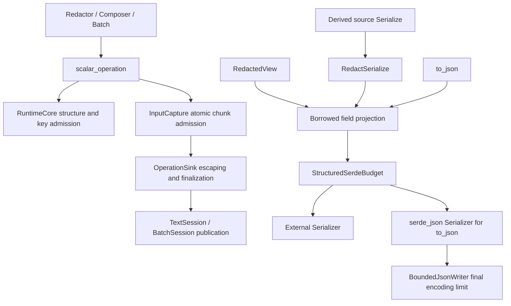

# qubit-redact Design

[中文设计文档](design.zh_CN.md) · [User Guide](user_guide.md) · [README](../README.md)

Current design: 0.8.0; runtime and derive share a version, Rust 1.94, empty default features.

## 1. Goals and boundaries

`qubit-redact` provides policy-driven, resource-bounded redaction for logs,
errors, and support diagnostics. It handles fields, domain objects, JSON, URI,
HTTP, environment variables, argv, and process descriptions. With redaction
enabled, every published `Complete`, `Truncated`, or `Exhausted` result must
exclude source values that were not approved for publication.

The crate does not erase memory, mutate source objects, or protect output that
bypasses its runtime. Field sensitivity is downstream domain knowledge: domain
models must identify sensitive fields explicitly instead of relying on guesses
from Rust types or current values.

## 2. Core invariants

1. `Redactor` owns an immutable `Arc<RedactionPolicy>` snapshot. Existing
   objects do not observe later application-default replacements.
2. Every composer, batch, or inspection owns an independent transaction and
   budget ledger.
3. Parser errors, input truncation, and budget exhaustion fail closed while
   redaction is enabled.
4. Scalar keys pass structural-length and input-byte admission before classification;
   classification precedes lazy value access or formatting.
5. Depth, nodes, collection items, input bytes, JSON values, and output bytes
   are charged to the same transaction.
6. Only a completed transaction constructs public summaries. Parsers and
   format executors never publish a second result model.
7. `RedactionPolicy::disabled()` is an explicit debugging escape hatch that
   restores source values; downstream code owns authorization and timing.
8. Hidden structured-Serde adapters establish a root admission scope when
   invoked directly and reuse an existing scope when nested. Calling a hidden
   capability without a scope must fail closed rather than bypass limits.

## 3. Architecture

```text
caller
  │
  ▼
Redactor + immutable RedactionPolicy snapshot
  ├── RedactedTextComposer ── TextSession ──► RedactionTextOutput
  ├── redact_* ────────────── TextSession ──► RedactionTextOutput
  ├── DiagnosticRedactionBatch ──────── BatchSession ─► diagnostics + handles
  └── inspect_* ───────────── InspectionSession ─► Result<RedactionInspection, Error>
                                  │
                                  ▼
                    RuntimeCore: budget, summary, phase
                                  │
                 ┌────────────────┼────────────────┐
                 ▼                ▼                ▼
              domain           formats          output
       RedactionWriter       JSON/HTTP/...   escaping and markers
```

Source responsibilities are:

- `facade`: public entry points, composer, batch, output, and summaries;
- `policy`: field and context rules, masks, and resource limits;
- `runtime`: shared transaction state, budgets, structural admission, sinks,
  and publication;
- `domain`: `Redact`, `RedactionWriter`, container adapters, and optional Serde
  bridges;
- `formats`: argv, env, process, JSON, URI, and HTTP parsing and rendering;
- `output`: log escaping, masked text, and completion states.

The façade, domain, and format layers depend on runtime and policy. Runtime is
independent of the public façade operation model. Formats return internal
`RenderedOperation` values, and the parent transaction is the only publisher.

### 3.1 Consumer views and two execution ledgers



A view borrows its source and owns an immutable policy snapshot. Creation does not access
the source; each formatting or serialization executes afresh. Text uses `Redact`, while
structured Serde uses the hidden `RedactSerialize` capability. Only `#[redact(serde)]` additionally replaces ordinary source
serialization. Explicit levels belong to the domain type and remain final under strict policy;
unmarked fields retain ordinary representations.

Nested projection fields and derived source serialization use the same hidden
`RedactSerialize` capability. Option and Vec projections require their element
types to implement that capability, so generic parents can serialize children
borrowing local data without a higher-ranked borrowed capability. Unsupported capabilities fail
when serialization is requested, while text-only derives remain valid.

Text RuntimeCore and synchronous Serde scopes have different lifetimes and own separate
ledgers. Serde scopes use PolicyFrame Arc snapshots and thread-local guards; nested and
ordinary serializers share the active budget, and errors or panic unwinding release the scope.
An original policy address is only a snapshot-reuse hint: its contents must still equal
the owned snapshot. This prevents a forgotten guard from applying an obsolete policy
after the caller replaces a policy at the same address.
Pre-serialization for measurement followed by a second execution is forbidden.

## 4. Policy model

`RedactionPolicy` combines field rules, masks, format policy, and
`RedactionLimits`. `standard()` is deterministic, `strict()` treats unknown
fields as `Secret`, and `disabled()` explicitly disables confidentiality
redaction.

Field resolution applies base rules before HTTP header/query/body context
rules. Context may strengthen sensitivity but cannot weaken an already stronger
base decision. The shared `ResolvedField::stronger` implementation owns this
security rule so formats do not duplicate it.

`Redactor::application_default()` reads a snapshot from the process-wide slot.
`replace_application_default()` replaces that slot linearly and returns the
previous value. Existing redactors, composers, and batches retain their prior
snapshot.

## 5. Transaction and publication models

### 5.1 Composer

`RedactedTextComposer` appends literals and redacted operations in order.
`literal` accepts only `&'static str`; dynamic data must use a redaction
operation. Consuming `finish(self)` publishes one `RedactionTextOutput`.

### 5.2 Batch

`DiagnosticRedactionBatch` creates independently resolvable items under one shared
budget. Each operation returns a handle valid only for that batch.
`finish_with_marker(self, marker)` publishes a diagnostics view: complete
items retain their safe text, while incomplete, missing, and cross-batch
handles resolve to the escaped marker. The view also retains the aggregate
summary.

### 5.3 Inspection

Inspection reuses policy and structural budgets while recording classification,
sensitivity, usage, and incomplete reasons without publishing raw values. An
inspection error means the conclusion is incomplete and must be treated as
sensitive when inspection controls a security decision.

### 5.4 RuntimeCore

`RuntimeCore` stores the policy snapshot, `RedactionBudget`, aggregate
`SummaryBuilder`, transaction phase, and optional item summary. `TextSession`,
`BatchSession`, and `InspectionSession` provide different publication models on
top. Operation sinks commit format results to the parent transaction instead of
creating child budgets or summaries.

## 6. Admission, budgeting, rendering, and publication

Structured operations use one pipeline:

```text
validate metadata
  → budget preflight
  → structural admission / parse once
  → policy resolution
  → bounded rendering and log escaping
  → record usage/reason/completion
  → publish through the parent transaction
```

Preflight happens before advancing untrusted iterators. JSON text is parsed once
during admission into an admitted tree. HTTP JSON, NDJSON, and multipart
rendering reuse admitted structures within the operation, avoiding a second
parse while rendering that result.

Flat structured formats such as argv and environment lists use one runtime
admission helper for root nodes, collection entries, child nodes, and source
bytes. Composer and batch retain different publication models, but cannot
silently drift in how they advance or charge the same source iterator.

When output space is insufficient, the runtime retains only complete UTF-8
prefixes and safe markers. `Truncated` means a safe but incomplete
representation remains; `Exhausted` means the budget could not retain a full
replacement. Callers read `RedactionSummary` and must not infer reasons by
parsing marker text.

### 6.1 Scalar admission, failure facts, and output closure

One-shot, composer, and batch share `runtime/scalar_operation.rs`: output preflight,
root-node admission, key-length check, key input-byte admission, classification, then formatting
only if needed. Rejected keys increase presented but not inspected bytes, without normalization
or value access. With redaction enabled, High/Secret writes a fixed mask after key admission.
`InputCapture` admits complete UTF-8 chunks and latches its first rejection. Accepted prefixes
remain charged but all raw text is discarded on failure. `ScalarFailure` distinguishes
InputLimit from FormatterFailure without carrying a public completion state.

OperationSink owns safe replacement and final state. If `<truncated>` fits after input or
formatter failure, completion is Truncated with only its real cause. If it cannot fit,
completion is Exhausted with actual OutputLimitReached. Actual output truncation with a fitting
marker is Truncated + OutputLimitReached. Ordinary masks are Complete. `RenderedOperation`
carries an independent output_closed fact; merge combines that fact, reasons, and completion.
Publication neither infers output exhaustion from generic failure nor discards earlier safe text.
Exhausted always has an output reason at its construction boundary.

An input-failing item allows later admitted work within the remaining budget; the aggregate
summary stays incomplete. Actual output rejection or exact capacity closes subsequent input
access. Caller-supplied post-publication markers are escaped but outside transaction output limits.

### 6.2 Serde payload and final encoding

`max_input_bytes` defaults to 64 KiB. `max_serde_payload_bytes` (serde feature) and
`max_output_bytes` independently default to 16 KiB. All allow zero; the latter two must fit isize::MAX.
Payload follows Serde events: UTF-8 strings/chars, byte slices, numeric/bool scalar representations,
zero for none/unit, dynamic map keys, and scalar unit-variant names. Static field names,
punctuation, escaping, and framing are excluded.

Direct Serialize(view/source) uses structure, input, and logical payload limits; the caller's
serializer/writer controls final encoding. `to_json` uses the same projection plus an independent
BoundedJsonWriter for all final bytes, including labels, escapes, quotes, punctuation, and masks.
It traverses once and returns a String only after complete encoding, keeping
Result<String, serde_json::Error>. Structural degradation may produce valid safe replacements,
so success does not imply completeness. Identical source state yields matching output when
both operations succeed; their success conditions are not equivalent.

Scalar text fields, handwritten domain nodes, and Serde events have distinct input admission
units; usage is not source-object memory size. Budgets cannot preempt arbitrary computation
inside user Display/Serialize or bound allocations performed before the library call.

## 7. Domain objects and Serde

`Redact::write_redacted` writes only through the active `RedactionWriter`.
The writer supports records, sequences, maps, nested values, explicit
sensitivity, runtime-key classification, JSON values, and explicit skips. Every
scope shares the parent budget; depth or collection rejection closes that scope
without opening another output path.

The `derive` feature exports `#[derive(Redact)]` and `#[derive(RedactScalar)]`; generated serialization
adapters additionally require `serde`. Hidden support traits and borrowed
adapters cover scalars, options, references, common containers, tuples, maps,
and JSON ownership forms. They are public only because generated code expands
in downstream crates; they are not an alternative user-facing serialization
API. Each adapter establishes or reuses the thread-local structural budget, so
direct construction cannot skip collection, depth, node, or input admission.
The internally tagged serializer accepts only map and struct shapes that
preserve the intended structure; unsupported Serde shapes return explicit
errors.

## 8. Format layer

- argv/env/process: explicit classification and bounded heuristics, with
  fail-closed non-UTF-8 handling;
- JSON: one parse, recursive field classification, explicit number ranges, and
  shared structural limits;
- URI: `fluent-uri` parsing with separate identity, path, query, and fragment
  handling;
- HTTP: URL, headers, and bodies, always returning to the parent transaction.

HTTP body implementation is split by responsibility:

- `redaction/body.rs`: admission dispatch and final publication;
- `json_body.rs`: JSON and NDJSON;
- `form_body.rs`: `application/x-www-form-urlencoded`;
- `multipart_body.rs`: multipart parts, nested content types, and file data;
- `text_body.rs`: text, binary, and unsupported fallbacks;
- `url.rs`: URL, nested URL, and query processing;
- `headers.rs`: header rendering;
- `diagnostics.rs`: bounded diagnostic text and completion.

These modules share a private `HttpPolicyExecutor`. It borrows the parent
session policy, owns no session, and produces no public HTTP result. Invalid
content types, missing multipart boundaries, invalid JSON/NDJSON, and truncated
input use safe markers with structured reasons.

`BodyCapture` alone owns source-truncation metadata. The parent runtime rejects
an HTTP body atomically when its captured bytes exceed the remaining input
allowance; renderers therefore do not model a second partial-input state.

## 9. Features and compatibility

The default feature set is empty:

- `derive`: derive macro;
- `serde`: domain serialization adapters and bigdecimal support;
- `json`: Serde JSON and `qubit-json`;
- `http`: includes `json` and adds HTTP, URL, form, and multipart support;
- `uri`: URI support through `fluent-uri`.

Public entry points live in `Redactor`, composer, batch, inspection, policy, and
the domain writer. Format executors, admitted trees, runtime sessions, and sinks
remain crate-private.

Version 0.7 intentionally changes budget semantics: direct Serde payload limits move from
`max_output_bytes` to `max_serde_payload_bytes`, without old-reason mappings, legacy budget
switches, or compatibility shims. Text failure markers and reasons follow actual admission
and output rejection. BigDecimal remains under `serde`; this release does not split that feature.

## 10. Verification strategy

The runtime coverage gate uses no file exemptions. Unit and integration tests cover public
policy builders, limits, domain writers, sealed capabilities, Serde shapes,
normal and fail-closed format paths, and composer/batch/inspection publication
contracts. Coverage requires at least 95% of functions and strictly more than
90% of both lines and regions.

Fuzz targets cover direct URI/URL input, command input, mixed transaction
sequences, JSON text, HTTP bodies, multipart bodies, and hidden structured-Serde
map adapters, and derive/view/to_json consumer entry points. Small transaction budgets assert
inspected/output ceilings and Exhausted provenance; valid NDJSON also checks visible fields and absence
of InvalidJson. Fixed-secret assertions check non-disclosure; arbitrary-byte
paths check determinism, valid UTF-8 output, bounded direct-adapter behavior,
and panic freedom. Criterion workloads cover scalar/domain/JSON paths plus the
downstream-heavy argv, environment, process, HTTP, and URI formats. CI also
runs formatting, style, Clippy, tests, rustdoc, and doctests. Consumer benchmarks separate view
creation, repeated Display/Serde, redact_text, to_json, collection scale, and input/payload/encoding
boundaries. Construction stays outside timing; elapsed time is not a correctness threshold.

## 11. Deliberate non-goals

- inferring domain sensitivity automatically;
- exposing a formatter or forgeable summary outside transactions;
- zeroizing source memory;
- turning `disabled()` into an authorization system;
- creating HTTP- or JSON-specific public output models;
- traversing untrusted input after exhaustion merely to improve diagnostics.
