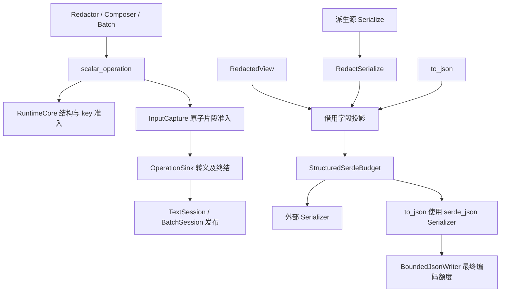

# qubit-redact 设计文档

[English Design](design.md) · [中文用户手册](user_guide.zh_CN.md) · [README](../README.zh_CN.md)

当前设计：0.8.0；runtime 与 derive 同步版本，Rust 1.94，默认空 feature。

## 1. 目标与边界

`qubit-redact` 为日志、错误信息和技术支持诊断提供策略驱动、有资源上限的脱敏。它处理字段、
领域对象、JSON、URI、HTTP、环境变量、argv 和进程描述，并保证启用脱敏时所有已发布文本在
`Complete`、`Truncated`、`Exhausted` 三种完成状态下都不泄露未获准的原值。

本 crate 不负责内存擦除、不修改源对象，也无法保护绕过本运行时的输出。字段敏感性属于下游领域
知识：领域模型必须显式标记敏感字段，框架不会从 Rust 类型或当前内容猜测。

## 2. 核心不变量

设计由以下不变量约束：

1. `Redactor` 持有不可变的 `Arc<RedactionPolicy>` 快照；已创建的对象不受应用默认值后续替换影响。
2. 每个 composer、batch 或 inspection 拥有独立事务和独立预算账本。
3. 启用脱敏时，解析错误、输入截断和预算耗尽均 fail closed，只发布安全替代文本及原因。
4. 标量 key 先通过结构长度与输入字节准入，再做敏感判定；判定先于惰性值访问和格式化。
5. 结构深度、节点数、集合项、输入字节、JSON 值和输出字节由同一事务统一计费。
6. 只有完成事务才能构造公开摘要；内部 parser 和 format executor 不发布第二套结果类型。
7. `RedactionPolicy::disabled()` 是显式调试逃生口，会恢复原值；授权和使用时机由下游负责。
8. 隐藏的结构化 Serde adapter 在直接调用时建立根准入 scope，嵌套调用则复用已有 scope；隐藏
   capability 在没有 scope 时必须 fail closed，不能绕过资源上限。

## 3. 总体架构

```text
调用方
  │
  ▼
Redactor + 不可变 RedactionPolicy 快照
  ├── RedactedTextComposer ── TextSession ──► RedactionTextOutput
  ├── redact_* ────────────── TextSession ──► RedactionTextOutput
  ├── DiagnosticRedactionBatch ──────── BatchSession ─► diagnostics + handles
  └── inspect_* ───────────── InspectionSession ─► Result<RedactionInspection, Error>
                                  │
                                  ▼
                  RuntimeCore：预算、摘要、事务阶段
                                  │
                 ┌────────────────┼────────────────┐
                 ▼                ▼                ▼
              domain           formats          output
       RedactionWriter       JSON/HTTP/...   转义与安全标记
```

源码按职责分为：

- `facade`：公开入口、composer、batch、输出和摘要；
- `policy`：字段规则、上下文规则、掩码与资源上限；
- `runtime`：共享事务状态、预算、结构准入、operation sink 和发布；
- `domain`：`Redact`、`RedactionWriter`、容器适配及可选 Serde 桥接；
- `formats`：argv、env、process、JSON、URI、HTTP 的解析与渲染；
- `output`：日志转义、掩码文本和完成状态。

依赖方向是 façade/domain/formats 指向 runtime 与 policy。runtime 不依赖公开 façade 的操作模型，
各 format 只返回内部 `RenderedOperation`，最终发布始终由父事务完成。

### 3.1 消费视图与两个执行账本



view 借用源并拥有不可变策略快照；创建不访问源，每次格式化或序列化重新执行。
文本通过 `Redact`，结构化 Serde 通过隐藏的 `RedactSerialize` capability，不要求
源对象自身实现 Serialize。`#[redact(serde)]` 才额外替换源的普通序列化行为。
显式 level 由领域类型定义，strict 不覆盖；未标注字段保持普通表示。

嵌套投影字段和派生源序列化使用同一个隐藏能力 `RedactSerialize`。
Option 和 Vec 投影要求元素实现该能力，避免高阶借用 capability 约束间接要求
源数据存活至 static。泛型父对象可以序列化借用局部数据的子对象，而无需子对象
自身实现普通 Serialize。缺少能力时在请求
序列化处报错，纯文本派生仍然有效。

文本 RuntimeCore 与同步 Serde scope 生命周期不同，分别拥有账本。Serde scope 使用
PolicyFrame 的 Arc 快照和线程局部 guard；嵌套及普通 serializer 复用活动预算，错误或
panic 展开会释放 scope。原始策略地址仅作为快照复用的提示，策略内容仍须与持有的
快照相等，避免 guard 被遗忘后，同一地址上的新策略误用旧快照。不能预序列化测量后
再执行第二次。

## 4. 策略模型

`RedactionPolicy` 聚合字段规则、掩码、格式策略和 `RedactionLimits`。`standard()` 提供确定性默认
策略，`strict()` 将未知字段按 `Secret` 处理，`disabled()` 明确关闭保密脱敏。

字段解析先应用基础规则，再应用 HTTP header/query/body 等上下文规则。上下文只能增强敏感度，
不能削弱已经判定为更敏感的基础结果；统一的 `ResolvedField::stronger` 实现承担该合并语义，避免
不同格式各自复制安全逻辑。

`Redactor::application_default()` 从进程级槽读取快照，
`replace_application_default()` 线性化替换该槽并返回旧值。替换不会追溯改变已有 redactor、composer
或 batch。

## 5. 事务与发布模型

### 5.1 Composer

`RedactedTextComposer` 按调用顺序把 literal 和脱敏操作组合成一个结果。`literal` 只接受
`&'static str`，动态数据必须进入脱敏操作。`finish(self)` 消费 composer，并发布单个
`RedactionTextOutput`。

### 5.2 Batch

`DiagnosticRedactionBatch` 在一个共享预算内创建多个独立 item。每个操作立即返回只在该 batch 内有效的
handle；`finish_with_marker(self, marker)` 发布诊断视图：完整 item 保留安全文本，不完整、
缺失或来自其他 batch 的 handle 统一解析为已转义 marker。诊断视图同时保留 batch 聚合摘要。

### 5.3 Inspection

inspection 复用相同策略和结构预算，只记录分类、敏感度、用量和不完整原因，不发布原始值。
inspection error 表示结论不完整；安全决策应按敏感处理。

### 5.4 RuntimeCore

`RuntimeCore` 保存策略快照、`RedactionBudget`、聚合 `SummaryBuilder`、事务阶段和可选 item 摘要。
`TextSession`、`BatchSession`、`InspectionSession` 在其上实现不同发布方式。operation sink 负责把
格式结果提交给父事务，避免子格式创建独立预算或摘要。

## 6. 准入、预算、渲染和发布

一次结构化操作遵循固定流水线：

```text
输入元数据检查
  → 预算预检
  → 结构准入/解析一次
  → 策略判定
  → 有界渲染与日志转义
  → 记录 usage/reason/completion
  → 父事务发布
```

预检发生在推进不可信迭代器之前。JSON 文本在准入时解析一次并建立 admitted tree；HTTP JSON、
NDJSON 和 multipart 的渲染复用本次操作已准入的结构，生成结果时无需再次解析。

argv、环境变量列表等扁平结构格式通过同一个 runtime admission helper 计费根节点、集合项、子节点
和源字节。composer 与 batch 保留不同发布模型，但同一输入迭代器的推进和计费规则不能各自漂移。

输出不足时只保留完整 UTF-8 前缀和安全标记。`Truncated` 表示仍有安全但不完整的表示，
`Exhausted` 表示预算无法容纳完整替代。调用方应读取 `RedactionSummary`，不能通过解析标记文本
推断原因。

### 6.1 标量准入、失败事实与输出关闭

one-shot、composer、batch 共享 `runtime/scalar_operation.rs`，依次进行输出预检、根节点
准入、key 长度检查、key 输入字节准入、分类、必要时格式化。拒绝 key 只增加 presented，
不增加 inspected，不规范化或访问值；脱敏启用时，High/Secret 准入 key 后直接输出固定掩码。
`InputCapture` 按完整 UTF-8 片段计量，首次拒绝后永久锁存。已接受前缀仍计费，失败时全部
丢弃原文；`ScalarFailure` 区分 InputLimit 与 FormatterFailure，不携带完成状态。

OperationSink 负责安全替代和最终状态。输入拒绝或 formatter 错误的 `<truncated>` 能完整
容纳时为 Truncated，仅保留真实原因；不能容纳时为 Exhausted，并记录实际 OutputLimitReached。
真实输出截断且标记可容纳时为 Truncated + OutputLimitReached。正常掩码为 Complete。
`RenderedOperation` 独立保存 output_closed，merge 合并该事实、原因和完成状态。
发布层不从泛化失败推断输出超限，也不丢弃前序安全文本。Exhausted 在构造边界必有输出原因。

输入失败项允许后项在剩余预算内继续，aggregate summary 仍不完整；真实输出拒绝或恰好
用尽额度关闭后续输入访问。发布后的调用方 marker 会转义，但不计入原事务输出额度。

### 6.2 Serde 载荷与最终编码

`max_input_bytes` 默认 64 KiB，`max_serde_payload_bytes`（serde feature）与
`max_output_bytes` 各默认 16 KiB；均允许 0，后两者不能超过 isize::MAX。
载荷沿 Serde 事件计量：字符串/字符 UTF-8、bytes 切片、数字/bool 标量表示，none/unit 为 0，
动态 map key 和标量形式的 unit variant 名称计入，静态字段名、标点、转义及 framing 不计入。

直接 Serialize(view/source) 使用结构、输入和逻辑载荷额度；最终编码由调用方 serializer/writer
控制。`to_json` 使用相同字段投影并通过独立 BoundedJsonWriter 限制全部最终编码字节，
包括标签、转义、引号、标点和掩码。它一次遍历，只有完整编码成功才返回 String；原有
Result<String, serde_json::Error> 保留。结构降级可以产生合法安全替代，故成功不代表完整。
同一源状态且两者均成功时，to_json 与直接序列化 view 输出一致；成功条件不等价。

文本字段、手写领域节点及 Serde 事件各有输入准入单位；usage 不是源对象内存大小。
预算无法抢占用户 Display/Serialize 内部任意计算，也不限制调用前分配。

## 7. 领域对象与 Serde

`Redact::write_redacted` 只能通过 `RedactionWriter` 写入当前事务。writer 支持 record、sequence、
map、嵌套对象、按敏感等级写入、按运行时 key 分类、JSON 值和显式 skip。所有 scope 共享父事务
预算，深度或集合上限失败时关闭对应结构，不创建旁路输出。

`derive` feature 导出 `#[derive(Redact)]` 和 `#[derive(RedactScalar)]`；生成的序列化适配还需要 `serde` feature。隐藏的支撑
trait 与借用 adapter 覆盖标量、可选值、引用、常用容器、tuple、map 和 JSON ownership 形态。
这些符号保持公开只是因为生成代码会在下游 crate 中展开，并不是另一套面向用户的序列化 API。
每个 adapter 都会建立或复用 thread-local 结构预算，因此直接构造也不能跳过集合、深度、节点和
输入准入。internally tagged serializer 只接受能够保持目标结构的 map/struct 形态，不支持的
Serde shape 返回明确错误而不是猜测表示。

## 8. 格式层

- argv/env/process：显式分类和受限启发式，非 UTF-8 输入 fail closed；
- JSON：一次解析、递归字段分类、显式数字范围和共享结构预算；
- URI：使用 `fluent-uri` 解析，并分别处理 identity、path、query、fragment；
- HTTP：处理 URL、header 和 body，所有结果回到父事务。

HTTP body 内部实现按职责拆分：

- `redaction/body.rs`：准入结果分派和最终 publication；
- `json_body.rs`：JSON 与 NDJSON；
- `form_body.rs`：`application/x-www-form-urlencoded`；
- `multipart_body.rs`：multipart part、嵌套 content type 和文件内容；
- `text_body.rs`：text、binary 和 unsupported fallback；
- `url.rs`：URL、nested URL 和 query；
- `headers.rs`：header；
- `diagnostics.rs`：有界诊断文本与完成状态。

这些模块共享私有 `HttpPolicyExecutor`，它只借用父 session 的 policy，不拥有 session，也不产生
公开 HTTP result。无效 content type、缺失 multipart boundary、非法 JSON/NDJSON 和截断输入均
通过安全 marker 与结构化 reason 表达。

来源截断元数据只由 `BodyCapture` 持有。当已捕获 body 超过父 runtime 的剩余输入额度时，父事务
会原子拒绝整段 body；renderer 不再维护第二套“部分输入”状态。

## 9. Feature 与兼容性

默认 feature 为空：

- `derive`：派生宏；
- `serde`：领域序列化适配和 bigdecimal 支持；
- `json`：Serde JSON 与 `qubit-json`；
- `http`：包含 `json`，并增加 HTTP、URL、form/multipart 支持；
- `uri`：`fluent-uri` URI 支持。

公开入口位于 `Redactor`、composer、batch、inspection、policy 和 domain writer。format executor、
admitted tree、runtime session 和 sink 保持 crate-private。

0.7 允许破坏性预算语义变更：直接 Serde 的载荷额度从 `max_output_bytes` 迁移到
`max_serde_payload_bytes`，不保留旧原因映射、旧预算开关或兼容 shim。文本失败标记与原因
按真实准入及输出拒绝生成。`serde` 仍包含 BigDecimal 支持，本次不拆分 feature。

## 10. 验证策略

runtime 覆盖率门禁不使用文件白名单。单元与集成测试覆盖公开策略 builder、限制、领域 writer、sealed
capability、Serde shape、所有格式的正常与 fail-closed 路径，以及 composer/batch/inspection
发布约束。覆盖率要求为函数至少 95%、行和 region 均严格大于 90%。

fuzz target 分别覆盖直接 URI/URL、命令输入、混合事务序列、JSON 文本、HTTP body、multipart
body、隐藏的结构化 Serde map adapter，以及 derive/view/to_json 消费入口。
混合事务使用小预算边界并断言 inspected/output 上限及 Exhausted 原因；有效 NDJSON 还验证公开字段和无 InvalidJson。固定敏感值断言验证“不泄露”，任意字节路径验证确定性、
UTF-8 输出、直接 adapter 的有界行为和无 panic。Criterion workload 除标量、领域对象和 JSON 外，
还覆盖下游重度使用的 argv、环境变量、进程、HTTP 和 URI。CI 还执行格式、style、Clippy、测试、
rustdoc 与 doctest。消费 benchmark 分别测 view 创建、重复 Display/Serde、redact_text、to_json、
集合规模和输入/载荷/最终编码边界，构造置于计时外，不把耗时当作正确性门槛。

## 11. 有意不做的事情

- 不自动推断领域字段敏感性；
- 不提供绕开事务的公开 formatter 或可伪造摘要；
- 不承诺原值内存清零；
- 不把 `disabled()` 包装成授权系统；
- 不为 HTTP 或 JSON 建立独立于事务的公开输出模型；
- 不在预算耗尽后继续遍历不可信输入以追求更完整的诊断。
